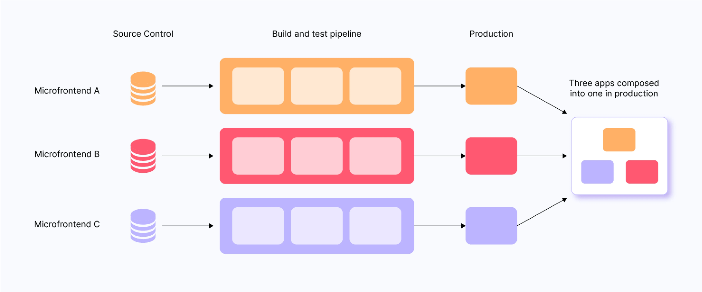

<div style="font-size: 17px;background: black;padding: 2rem;">

Microfrontend is an architectural style where a web application is divided into small, independently deployable frontend components or modules. Each module is developed and maintained by different teams, often using different technologies, but collectively they function as a single application.

<h3 style="border-bottom: 2px solid white; padding-bottom: 2px; display: inline-block;">Key Principles of Microfrontend:</h3>

<b style="color:Khaki;">1. Independence:</b> Each microfrontend operates independently, handling its own functionality, state management, and rendering.<br>
<b style="color:Khaki;">2. Technology Agnostic:</b> Different microfrontends can use different frameworks or libraries (e.g., React, Angular, Vue.js).<br>
<b style="color:Khaki;">3. Autonomous Deployment:</b> Each microfrontend can be built, tested, and deployed independently.<br>
<b style="color:Khaki;">4. Composition:</b> The main application integrates these smaller frontends dynamically, often during runtime, using techniques like iframes, Web Components, or JavaScript imports.

<br>

<br>

# METHODS OF IMPLEMENTING MICROFRONTEND

<h3 style="border-bottom: 2px solid white; padding-bottom: 2px; display: inline-block; font-size: 27px;">1. iframe-Based Composition</h3>

This approach leverages iframes to isolate microfrontends, where each module runs within its own iframe.

**WORKING:**

1. Each microfrontend is deployed as an independent application, accessible via a URL.
2. The shell application integrates these microfrontends using iframes.
3. Communication between iframes is managed through postMessage or shared storage.

**ADVANTAGES:**

- <span style="color: SpringGreen;">Complete Isolation:</span> Each microfrontend is sandboxed, preventing style or script interference.
- <span style="color: SpringGreen;">Ease of Integration:</span> Simple to integrate legacy or third-party applications.

**DISADVANTAGES:**

- <span style="color: SpringGreen;">Performance Issues:</span> Increased resource usage and slower interactions due to iframe overhead.
- <span style="color: SpringGreen;">Limited Communication:</span> Cross-iframe communication is less efficient and harder to manage.
- <span style="color: SpringGreen;">Poor User Experience:</span> Navigational consistency may be challenging.

**BEST USE CASES:**

- Applications requiring strict isolation, such as embedding third-party or legacy systems.
- Multi-tenant applications where different tenants have their own frontends.

<h3 style="border-bottom: 2px solid white; padding-bottom: 2px; display: inline-block; font-size: 27px;">2. Build Time Integration</h3>

In Build-Time Integration, the microfrontends are integrated during the build phase. This means all individual modules are combined into a single application bundle before deployment.

**WORKING:**

1. Each team develops its part of the application (microfrontend) in isolation.
2. These parts are packaged into modules (e.g., npm packages or other library formats).
3. During the build process, the orchestrator (often a build tool like Webpack, Vite, or Rollup) combines these modules into one application.

**ADVANTAGES:**

- <span style="color: SpringGreen;">Performance Optimized:</span> Since all modules are bundled together at build time, the resulting application is highly optimized for performance.
- <span style="color: SpringGreen;">Simpler Runtime:</span> No runtime orchestration is required since everything is pre-integrated.
- <span style="color: SpringGreen;">Uniformity:</span> Ensures consistency in versioning and shared dependencies.

**DISADVANTAGES:**

- <span style="color: SpringGreen;">Lack of Autonomy:</span> Teams cannot independently deploy updates. Any change requires rebuilding the entire application.
- <span style="color: SpringGreen;">Tight Coupling:</span> Dependencies across modules must be carefully managed to avoid conflicts.

**BEST USE CASES:**

- Applications with relatively static modules where changes are infrequent.
- Teams that prioritize performance and don’t require independent deployments.

<h3 style="border-bottom: 2px solid white; padding-bottom: 2px; display: inline-block; font-size: 27px;">3. Client-Side Composition</h3>

In Client-Side Composition, the integration of microfrontends happens in the user's browser. A shell application fetches and renders the required microfrontends at runtime.

**WORKING:**

1. The shell or container application acts as the entry point for the user.
2. At runtime, the shell fetches individual microfrontends as JavaScript bundles or modules.
3. The shell mounts these modules into predefined placeholders on the page.

**ADVANTAGES:**

- <span style="color: SpringGreen;">Independent Deployment:</span> Teams can deploy updates to their microfrontends without affecting others.
- <span style="color: SpringGreen;">Full Flexibility:</span> New features or modules can be added dynamically without rebuilding the entire app.
- <span style="color: SpringGreen;">Scalability:</span> Each microfrontend can be independently scaled based on its traffic.

**DISADVANTAGES:**

- <span style="color: SpringGreen;">Performance Overhead:</span> Increased number of HTTP requests and JavaScript parsing at runtime can slow down the initial load.
- <span style="color: SpringGreen;">Shared Dependencies:</span> Managing shared libraries and dependencies across microfrontends requires careful handling to avoid duplication or conflicts.

**BEST USE CASES:**

- Large-scale applications with distributed teams.
- Projects where runtime flexibility and independent deployment are critical.

<h3 style="border-bottom: 2px solid white; padding-bottom: 2px; display: inline-block; font-size: 27px;">4. Server-Side Composition</h3>

In Server-Side Composition, the microfrontends are integrated at the server level. Each microfrontend produces an HTML fragment, and the server stitches these fragments together into a single page.

**WORKING:**

1. Individual teams host their microfrontends on separate servers or endpoints.
2. When a user requests a page, the server fetches the required HTML fragments from the respective microfrontends.
3. The server composes these fragments into a single HTML document and sends it to the client.

**ADVANTAGES:**

- <span style="color: SpringGreen;">SEO-Friendly:</span> Since the composition happens on the server, search engines receive fully rendered pages.
- <span style="color: SpringGreen;">Dynamic Composition:</span> Microfrontends can be included or excluded based on user preferences or request context.
- <span style="color: SpringGreen;">Faster Initial Load:</span> The server handles rendering, reducing the burden on the client’s browser.

**DISADVANTAGES:**

- <span style="color: SpringGreen;">Complex Orchestration:</span> Requires a robust server-side orchestration mechanism.
- <span style="color: SpringGreen;">Potential Latency:</span> Increased request latency if server-side composition involves many network calls.
- <span style="color: SpringGreen;">Harder Debugging:</span> Issues can arise from the orchestration layer, making debugging more challenging.

**BEST USE CASES:**

- Applications where SEO is critical, like e-commerce platforms or content-heavy websites.
- Scenarios where personalization or dynamic rendering is required.

<h3 style="border-bottom: 2px solid white; padding-bottom: 2px; display: inline-block; font-size: 27px;">5. Edge-Side Includes (ESI)</h3>

The only difference between Server-Side Composition (SSC) and Edge-Side Includes (ESI) lies in where the composition happens and the infrastructure used for it:

**Server-Side Composition (SSC):**

- <span style="color: SpringGreen;">Where:</span> The composition is performed on the application server.
- <span style="color: SpringGreen;">Infrastructure:</span> A central server (or set of servers) is responsible for fetching microfrontend fragments, stitching them together into a single HTML document, and sending the response to the client.
- <span style="color: SpringGreen;">Latency:</span> Dependent on the server's location relative to the user, which can introduce latency if the user is far from the server.
- <span style="color: SpringGreen;">Use Case:</span>
  - When you need more control over the rendering process.
  - If the application has heavy server-side logic that integrates with backend services.
  - When edge-computing infrastructure is not available or necessary.

**Edge-Side Includes (ESI):**

- <span style="color: SpringGreen;">Where:</span> The composition happens at the edge server (e.g., a CDN or specialized edge-computing infrastructure like Akamai, Cloudflare, or AWS CloudFront).
- <span style="color: SpringGreen;">Infrastructure:</span> Distributed CDN nodes handle the composition, reducing the distance between the server and the user.
- <span style="color: SpringGreen;">Latency:</span> Significantly reduced because edge servers are geographically closer to the user.
- <span style="color: SpringGreen;">Use Case:</span>
  - When the primary concern is speed and scalability for a globally distributed audience.
  - If the application already leverages CDN infrastructure.
  - For simpler integrations where edge servers can perform the assembly without requiring intensive backend logic.

<h3 style="border-bottom: 2px solid white; padding-bottom: 2px; display: inline-block; font-size: 27px;">6. Module Federation (Webpack 5)</h3>

Module Federation allows microfrontends to expose and consume modules dynamically at runtime, as defined in Webpack 5.

**WORKING:**

1. Each microfrontend defines a Webpack configuration to expose its modules.
2. A shell application dynamically loads these modules using Webpack’s runtime.

**ADVANTAGES:**

- <span style="color: SpringGreen;">Dynamic Loading:</span> Modules can be updated or added without redeploying the entire app.
- <span style="color: SpringGreen;">Shared Dependencies:</span> Efficient handling of shared libraries to avoid duplication.
- <span style="color: SpringGreen;">Modern and Efficient:</span> Leverages modern tooling for optimized workflows.

**DISADVANTAGES:**

- <span style="color: SpringGreen;">Complex Configuration:</span> Requires expertise with Webpack and Module Federation.
- <span style="color: SpringGreen;">Dependency Conflicts:</span> Improper version management can lead to runtime issues.

**BEST USE CASES:**

- Modern applications prioritizing runtime flexibility and efficiency.
- Teams with strong expertise in Webpack.

<h3 style="border-bottom: 2px solid white; padding-bottom: 2px; display: inline-block; font-size: 27px;">7. Web Components</h3>

In this approach, each microfrontend is implemented as a Web Component, a browser-native technology that encapsulates functionality and styles.

**WORKING:**

1. Teams develop microfrontends using the Web Components standard (Custom Elements, Shadow DOM, and HTML templates).
2. Each Web Component is distributed as a reusable component.
3. The main application imports and uses these components.

**ADVANTAGES:**

- <span style="color: SpringGreen;">Encapsulation:</span> Strong isolation of styles and functionality through Shadow DOM.
- <span style="color: SpringGreen;">Framework Agnostic:</span> Works seamlessly with any frontend framework or vanilla JavaScript.
- <span style="color: SpringGreen;">Long-Term Compatibility:</span> Built on web standards, ensuring compatibility across modern browsers.

**DISADVANTAGES:**

- <span style="color: SpringGreen;">Learning Curve:</span> Teams unfamiliar with Web Components may face a learning curve.
- <span style="color: SpringGreen;">Compatibility Issues:</span> Older browsers may require polyfills for support.
- <span style="color: SpringGreen;">Communication:</span> Requires custom mechanisms for cross-component communication.

**BEST USE CASES:**

- Applications requiring long-term maintainability and high encapsulation.
- Projects with heterogeneous technology stacks.

<br>

# Ways by which microfrontends communicate

<h3 style="border-bottom: 2px solid white; padding-bottom: 2px; display: inline-block; font-size: 27px;">1. URL-Based Communication</h3>

Microfrontends can communicate through the browser's URL. Each microfrontend updates the URL to reflect its state, and other microfrontends can respond to changes in the URL.

**MECHANISM:**

- Use query parameters, hash fragments, or the pathname.
- Leverage routing frameworks like React Router or Vue Router.

**USE CASE:** Navigation between microfrontends or passing lightweight data.

**EXAMPLE:**

- Microfrontend A changes the URL: `https://example.com/app1?user=123`.
- Microfrontend B listens for URL changes and reacts accordingly.

<h3 style="border-bottom: 2px solid white; padding-bottom: 2px; display: inline-block; font-size: 27px;">2. Custom Events</h3>

Microfrontends can dispatch and listen for custom events on the `window` or `document` object ->` window.dispatchEvent()` and `window.addEventListener()`.

Example:

```js
// Microfrontend A
const event = new CustomEvent('userLoggedIn', { detail: { userId: 123 } });
window.dispatchEvent(event);

// Microfrontend B
window.addEventListener('userLoggedIn', (event) => {
  console.log(event.detail.userId); // 123
});
```

<h3 style="border-bottom: 2px solid white; padding-bottom: 2px; display: inline-block; font-size: 27px;">3. Browser Storage (LocalStorage / SessionStorage)</h3>

Microfrontends can communicate by writing to `localStorage` or `sessionStorage` and listening for the storage event. 

**USE CASE:** Passing persistent data like user preferences or authentication tokens.

```js
// Microfrontend A
localStorage.setItem('user', JSON.stringify({ id: 123 }));

// Microfrontend B
window.addEventListener('storage', (event) => {
  if (event.key === 'user') {
    console.log(JSON.parse(event.newValue)); // { id: 123 }
  }
});
```

<h3 style="border-bottom: 2px solid white; padding-bottom: 2px; display: inline-block; font-size: 27px;">4. API Gateway or Backend Communication</h3>

Microfrontends can communicate indirectly by interacting with a shared backend or API gateway. Each microfrontend makes API calls to the same backend services.

**EXAMPLE:**

1. Microfrontend A sends a `POST` request to `/api/session` to set a user session.
2. Microfrontend B fetches the session using a `GET` request to `/api/session`.

</div>
