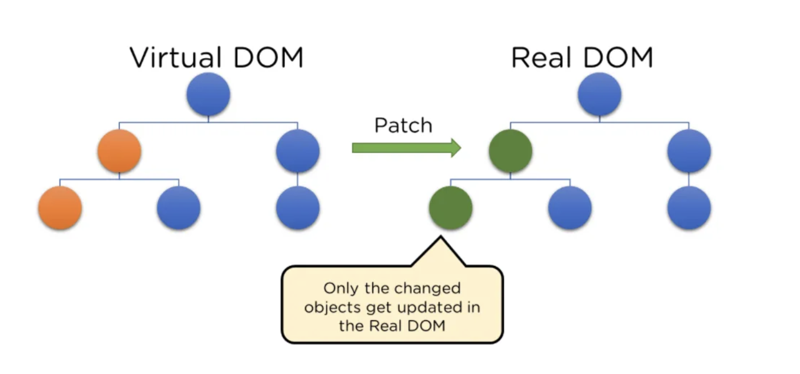

<div style="font-size: 17px;background: black;padding: 2rem;">

# WHAT IS REACT?

React is an open-source frontend JavaScript library for rendering user interfaces (UI). UI is built from small units like buttons, text, and images. React lets you combine them into reusable, nestable components. It is maintained by Meta (formerly Facebook) and a community of individual developers and companies. React can be used to develop single-page, mobile, or server-rendered applications with frameworks like `Next.js`. Because React is only concerned with the user interface and rendering components to the DOM, React applications often rely on libraries for routing and other client-side functionality.

<br>

# WHY REACT?

- <b style="color: DarkSalmon;">Component-Based Architecture:</b> React follows a component-based architecture, which encourages building UIs as a composition of reusable and self-contained components. This modularity makes code easier to maintain, understand, and reuse.

- <b style="color: DarkSalmon;">Virtual DOM and Efficient Updates:</b> When something in your application changes—say, a user clicks a button or new data arrives—the DOM needs to update to reflect that change. However, directly manipulating the real DOM can be slow. Each change triggers the browser to recalculate the layout, repaint the page, and perform other resource-intensive tasks. If your app makes frequent or complex updates, this can lead to performance bottlenecks. <br>The Virtual DOM is React’s solution to this problem. It’s a lightweight, in-memory copy of the real DOM, represented as a JavaScript object. Unlike the real DOM, which is tied to the browser’s rendering engine, the Virtual DOM exists purely in JavaScript and doesn’t carry the overhead of actual DOM elements. You can think of it as a blueprint or shadow of the real DOM. In React, when you define your UI using components and JSX (a syntax that looks like HTML but gets compiled into JavaScript), you’re actually constructing this Virtual DOM. It's working:

  1. **Initial Rendering:** When your React app starts, it creates a Virtual DOM based on your components and renders it into the real DOM. At this point, the Virtual DOM and real DOM are in sync.
  2. **State or Props Change:** When your application’s state or props change (e.g., a user types in an input field), React doesn’t immediately update the real DOM. Instead, it builds a new Virtual DOM reflecting the updated UI.
  3. **Reconciliation and Diffing:** React then compares the new Virtual DOM with the previous Virtual DOM. This comparison process is called reconciliation, and it uses a diffing algorithm to identify what has changed. For example:
     The diffing algorithm is smart and efficient, figuring out the minimal set of changes needed. The diffing algorithm is smart and efficient, figuring out the minimal set of changes needed.
  4. **Batching Updates:** Once React knows what’s different, it batches these changes and applies them to the real DOM in a single update. This minimizes direct DOM manipulations, which are costly, and ensures the real DOM reflects the new Virtual DOM.
  5. **Selective Updates:** Importantly, React doesn’t repaint the entire page—it only updates the parts of the real DOM that changed. If a single `<p>` tag’s text updates in a large app, only that specific node is touched.

  When reconciling lists of elements, React uses the <span style="color: Cyan;">key</span> attribute to identify which elements have changed, been added, or been removed. Keys help React efficiently reorder, add, or remove items in a list without re-rendering all items.

<br>

- <b style="color: DarkSalmon;">Unidirectional Data Flow:</b> React follows a unidirectional data flow, where data flows in a single direction, from parent components to child components. This pattern makes it easier to understand how data changes and propagates through the application, simplifying debugging and state management.

- <b style="color: DarkSalmon;">JSX:</b> React uses JSX, a syntax extension that allows developers to write declarative UI code by combining JavaScript and HTML-like syntax. JSX makes code more readable, maintainable, and less error-prone.

- <b style="color: DarkSalmon;">State Management:</b> React components can maintain their own internal state, making it easier to build interactive UIs. For larger applications, state management libraries like `Redux` or `Context` API can be used.

- <b style="color: DarkSalmon;">Rich Ecosystem and Community:</b> React has a vast and active community of developers, which means a wealth of resources, libraries, and tools are available. This ecosystem provides solutions for various use cases, making development faster and more efficient.

- <b style="color: DarkSalmon;">Developer Tools:</b> React comes with powerful developer tools like React DevTools, which allow developers to inspect, debug, and profile React applications. These tools aid in identifying performance bottlenecks and optimizing the application.

- <b style="color: DarkSalmon;">Cross-Platform Development:</b> With React Native, developers can use their existing React skills to build mobile applications for both iOS and Android platforms. This code-sharing capability significantly reduces development time and effort.

- <b style="color: DarkSalmon;">SEO-Friendly:</b> React supports server-side rendering (SSR), which allows search engines to index the content effectively. This enhances SEO (Search Engine Optimization) and improves the discoverability of web applications.

- <b style="color: DarkSalmon;">Large Community and Continuous Improvement:</b> React is backed by Facebook and a large community of developers worldwide. Continuous improvements, updates, and bug fixes are released regularly, ensuring that the library remains up-to-date and well-maintained.

- <b style="color: DarkSalmon;">Testability:</b> React's component-based structure makes it easier to write unit tests for individual components. The React ecosystem provides testing tools like Jest and Enzyme, which facilitate comprehensive testing of React applications.

- <b style="color: DarkSalmon;">Open Source and Free:</b> React is an open-source library, which means it is free to use and available for anyone to contribute to and customize as needed.

<br>

# SETTING UP A REACT ENVIRONMENT

1. <b>Node.js and npm:</b> React.js requires `Node.js` and `npm` (Node Package Manager) to be installed on your computer. `Node.js` allows developers to run JavaScript code outside of a web browser. It comes with a powerful package manager called `npm` (Node Package Manager), which provides access to a vast ecosystem of open-source libraries and modules.

2. <b>Create React App (Recommended)</b>: The <span style="color: DeepSkyBlue;">create-react-app</span> is an excellent tool for beginners, which allows you to create and run React project very quickly. It does not take any configuration manually. This tool is wrapping all of the required dependencies like Webpack, Babel for React project itself and then you need to focus on writing React code only. This tool sets up the development environment, provides an excellent developer experience, and optimizes the app for production. Run this command in terminal:

   ```bash
   npx create-react-app your-project-name
   ```

3. <b>Navigate to project folder and start the development server: </b> Navigate to project folder and run below command:

   ```bash
   npm start
   ```

<br>

# REACT DEVELOPER TOOLS

**Use React Developer Tools to inspect React components, edit props and state, and identify performance problems.**

The easiest way to debug websites built with React is to install the React Developer Tools browser extension. It is available for several popular browsers:

- <a href="https://chrome.google.com/webstore/detail/react-developer-tools/fmkadmapgofadopljbjfkapdkoienihi?hl=en">Install for Chrome</a>
- <a href="https://react.dev/learn/react-developer-tools#:~:text=Install%20for%20Chrome-,Install%20for%20Firefox,-Install%20for%20Edge">Install for Firefox</a>
- <a href="https://microsoftedge.microsoft.com/addons/detail/react-developer-tools/gpphkfbcpidddadnkolkpfckpihlkkil">Install for Edge</a>

For other browsers (for example, Safari), install the `react-devtools` npm package:

```bash
# Yarn
yarn global add react-devtools

# Npm
npm install -g react-devtools
```

Next open the developer tools from the terminal:

```bash
react-devtools
```

Then connect your website by adding the following `<script>` tag to the beginning of your website’s `<head>`:

```html
<html>
  <head>
    <script src="http://localhost:8097"></script>
  </head>
</html>
```

Now, if you visit a website built with React, you will see the <b style="color:Orange;">Components</b> and <b style="color:PaleGreen;">Profiler</b> panels.

<br>

### For using TypeScript in React check this link: <a href="https://react.dev/learn/typescript">How to use TypeScript in React</a>

<br>

# FILES AND BASIC FOLDER STRUCTURE OF REACT PROJECTS

- <b>node_modules</b> folder -> This folder contains all the external dependencies that are installed via `npm`. These external packages are required for your application to function properly and include various libraries, tools, and utilities.

- <b>public</b> folder -> This folder contains all the public assets and the HTML template file (`index.html`). The `index.html` file is the entry point of your application and where your React app is mounted.

- <b>src</b> folder -> This folder contains all the source code of your React application. It includes the main entry point file (`index.js`) and other components, pages, assets, utilities, services, etc.

- <b>index.html</b> -> It is the main HTML file of our app that includes your React code and provides a context for React to render to. It is the initial page that gets loaded in the user's web browser when they access the application. If you look at the html file you could see `<div id="root"></div>`. We call this a “root” DOM node because everything inside it will be managed by React DOM. That is the mounting point for react app.

- <b>index.js</b> -> This file is the main entry point of your React application. It typically imports the <span style="color: HotPink;">ReactDOM</span> and the root component (`App.js` or another top-level component) and renders it into the DOM.

- <b>App.js</b> -> This is the main component of your application. It is usually the root component that contains the overall structure and layout of your app.

- <b>.gitignore</b> -> This file lists the files and directories that should be ignored by the version control system (e.g., Git) when committing changes.

- <b>package.json</b> -> This file contains the project's metadata, configuration, and a list of dependencies needed for the project to run. It is created automatically when you run `npm init` or `npx create-react-app`. Breaking down the key parts of this file:

  1. Project Metadata: The package.json file includes metadata about the project, such as the project's name, version, description, author, license, and other relevant information.

  2. Dependencies: One of the most important sections of package.json is the dependencies field. It lists all the external libraries and packages that your React application depends on to function correctly. These dependencies are installed when you run npm install or yarn install to set up the project.

  3. DevDependencies: In addition to regular dependencies, the package.json file may contain a devDependencies field. This section lists dependencies that are only required during development and testing but are not needed for the application to run in a production environment. Common examples include testing libraries and build tools.

  4. Scripts: The scripts section in package.json allows you to define custom scripts that you can run using npm run <script-name> or yarn <script-name>. Common scripts include "start" for starting the development server, "build" for creating a production build, and "test" for running tests.

- <b>package-lock.json</b> -> This file is automatically generated by npm to lock the versions of dependencies that are installed in your project.

- <b>README.md</b> -> This file typically contains documentation about your project, including installation instructions and other important details.

<br>

# Rendering

“Rendering” means that React is calling your component, which is a function. It is a process where React creates and updates the UI by converting components into DOM elements. It involves several steps, starting from the React component definitions and ending with the actual changes in the browser's DOM. Here’s a detailed breakdown of the rendering process:

<h3 style="border-bottom: 2px solid white; padding-bottom: 2px; display: inline-block;">1. Initial Rendering</h3>

The initial rendering happens when a React application is loaded for the first time. Following steps are involved:

<b style="color:Salmon;">1. Component Definition:</b> Developers define React components using JavaScript and optionally JSX.

```jsx
export default function Image() {
  return (
    
  );
}
```

<b style="color:Salmon;">2. Trigger Render:</b> It’s done by calling <span style="color: HotPink;">createRoot</span> with the target DOM node, and then calling its <span style="color: Gold;">render</span> method with your component.

```jsx
import Image from './Image.js';
import { createRoot } from 'react-dom/client';

const root = createRoot(document.getElementById('root'));
root.render(<Image />);
```

<b style="color:Salmon;">3. Virtual DOM Creation:</b> React creates a Virtual DOM representation of the component tree by recursively calling the render methods of all components in the hierarchy.

<b style="color:Salmon;">4. Creating the real DOM (Commit Phase):</b> Since this is the first render, there’s no existing Virtual DOM. React directly generates the real DOM with the elements and attributes defined in the Virtual DOM using the `appendChild()` DOM API.

<b style="color:Salmon;">5. Browser Paint:</b> The browser renders the updated DOM on the screen.

<h3 style="border-bottom: 2px solid white; padding-bottom: 2px; display: inline-block;">2. Re-rendering</h3>

There are two reasons for a component to render:

1. It’s the component’s initial render.
2. The component’s (or one of its ancestors’) state has been updated.

The process of initial render is explained above. For subsequent renders, React will call the function component whose state update triggered the render. This process is recursive: if the updated component returns some other component, React will render that component next, and if that component also returns something, it will render that component next, and so on. The process will continue until there are no more nested components and React knows exactly what should be displayed on screen.

Here are the steps followed in re-rendering:

**STATE UPDATE --> NEW VIRTUAL DOM GENERATION --> DIFFING --> UPDATING REAL DOM WITH MINIMAL CHANGES -> BROWSER PAINT**

<br>

<div style="border: 1px solid yellow; padding: 10px; background-color: rgba(103, 114, 230, 0.2);">

In modern React (React 17 and later), importing `React` from `"react"` is not always required when defining components. However, in older versions of React, it was necessary. Here’s why:

<u>**Before React 17 (Required):**</u> React components use JSX, which gets compiled into `React.createElement()` calls. Since `React.createElement()` was needed in the compiled code, React had to be imported explicitly. Without importing `React`, this would cause an error because `React.createElement` wouldn’t be available.

<u>**React 17 and Later (Not Required):**</u> With React 17, React introduced the new JSX transform, which no longer requires `React` in scope. Instead of converting JSX into `React.createElement()`, it uses functions from the `react/jsx-runtime` package.

</div>

</div>
