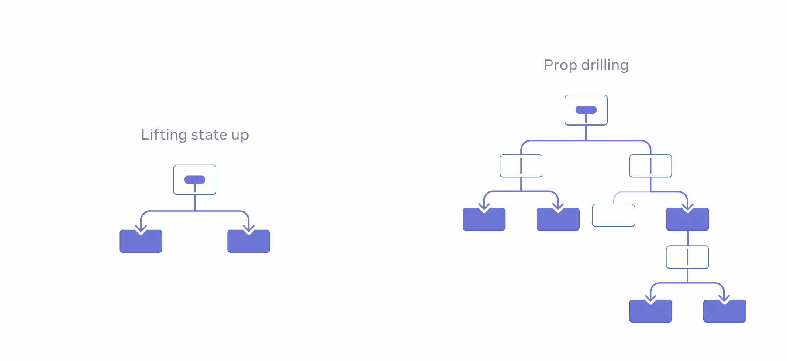

<div style="font-size: 17px;background: black;padding: 2rem;">

<b>Usually, you will pass information from a parent component to a child component via props. But passing props can become verbose and inconvenient if you have to pass them through many components in the middle, or if many components in your app need the same information. `Context` lets the parent component make some information available to any component in the tree below it—no matter how deep—without passing it explicitly through props.</b>

<h3 style="border-bottom: 2px solid white; padding-bottom: 2px; display: inline-block;">The problem with passing props</h3>

Passing props is a great way to explicitly pipe data through your UI tree to the components that use it. But passing props can become verbose and inconvenient when you need to pass some prop deeply through the tree, or if many components need the same prop. The nearest common ancestor could be far removed from the components that need data, and lifting state up that high can lead to a situation called “prop drilling”.

<br>

Wouldn’t it be great if there were a way to “teleport” data to the components in the tree that need it without passing props? With React’s `context` feature, there is! `Context` lets a parent component provide data to the entire tree below it. This is particularly useful when you have data that many components in different parts of your application need access to, such as user authentication, theme preferences, or language settings.

<h3 style="border-bottom: 2px solid white; padding-bottom: 2px; display: inline-block;">STEPS FOR USING CONTEXT</h3>

<h4>1. CREATE THE CONTEXT: </h4>

First, you need to create a context using the <b style="color: Chartreuse;">createContext</b> API of React. It returns a context object that consists of a `Provider` component and a `Consumer` component (though the Consumer is often used with class components and in some specific cases). The only argument it takes is the default value - the value that you want the context to have when there is no matching context provider in the tree above the component that reads context.

```js
// userContext.js
import React from 'react';
const defaultValue = 'Default Context Value'
export const UserContext = React.createContext(defaultValue);
```

<h4>2. PROVIDE THE CONTEXT</h4>

Wrap the part of your component tree that needs access to the context data with the Provider component. This is usually done at the highest level where the context data is available.
<br>

```js
// ParentComponent.js
import React from "react";
import ChildComponent from "./ChildComponent";
import { UserContext } from "./userContext";
const ParentComponent = () => {
  return (
    <UserContext.Provider value="Congrats! You Have Succesfully Provided Context Value!" >
      <ChildComponent />
    </UserContext.Provider>
  );
};
export default ParentComponent;
```

<h4>3. CONSUMING CONTEXT DATA</h4>

To access the context data within your functional components, use the <b style="color: Chartreuse;">useContext</b> hook. It only takes `SomeContext`(the context that you’ve previously created with `createContext`) as argument and returns the context value for the calling component. It is determined as the `value` passed to the closest `SomeContext.Provider` above the calling component in the tree. If there is no such provider, then the returned value will be the `defaultValue` you have passed to `createContext` for that context. The returned value is always up-to-date. <b style="color:red;">React automatically re-renders components that read some context if it changes.</b>

```js
// ChildComponent.js
import React from "react";
import GrandChildComponent from "./GrandChildComponent";
const ChildComponent = () => {
  return <GrandChildComponent />;
};
export default ChildComponent;
```

```js
// GrandChildComponent.js
import React, { useContext } from "react";
import { UserContext } from "./userContext";
const GrandChildComponent = () => {
  const value = useContext(UserContext);
  return <div>Context Usability via useContext method Status : {value}</div>; //We get value passed from ParentComponent
};
export default GrandChildComponent;
```

<h3 style="border-bottom: 2px solid white; padding-bottom: 2px; display: inline-block;">Use cases for context</h3> 

- **Theming:** If your app lets the user change its appearance (e.g. dark mode), you can put a context provider at the top of your app, and use that context in components that need to adjust their visual look.
- **Current account:** Many components might need to know the currently logged in user. Putting it in context makes it convenient to read it anywhere in the tree. Some apps also let you operate multiple accounts at the same time (e.g. to leave a comment as a different user). In those cases, it can be convenient to wrap a part of the UI into a nested provider with a different current account value.
- **Routing:** Most routing solutions use context internally to hold the current route. This is how every link “knows” whether it’s active or not. If you build your own router, you might want to do it too.
- **Managing state:** As your app grows, you might end up with a lot of state closer to the top of your app. Many distant components below may want to change it. It is common to use a reducer together with context to manage complex state and pass it down to distant components without too much hassle.

<h3 style="border-bottom: 2px solid white; padding-bottom: 2px; display: inline-block;">Updating data passed via context using state</h3> 

Often, you’ll want the context to change over time. To update context, combine it with state. Declare a state variable in the parent component, and pass the current state down as the context value to the provider.

```js
function MyPage() {
  const [theme, setTheme] = useState('dark');
  return (
    <ThemeContext.Provider value={theme}>
      <Form />
      <Button onClick={() => {
        setTheme('light');
      }}>
        Switch to light theme
      </Button>
    </ThemeContext.Provider>
  );
}
```

<h3 style="border-bottom: 2px solid white; padding-bottom: 2px; display: inline-block;">Scaling Up with Reducer and Context</h3> 

When building large-scale React applications, managing state becomes challenging as the app grows in complexity. A common and scalable approach is to combine the Reducer pattern (using `useReducer`) with the `Context` API. This pattern allows you to handle complex state transitions while providing global access to the state and actions, avoiding issues like prop drilling.

<u>Steps to Implement:</u>

1. Define a context for your state and dispatch.
2. Create a reducer function for state management.
3. Set up a context provider that uses the reducer and shares the state and dispatch.
4. Use the context in components to access the global state and actions.

</div>

<!-- <div style="background: DarkRed;  padding: 0.3rem 0.8rem;"> => HIGHLIGHT -->
<!-- <h3 style="border-bottom: 2px solid white; padding-bottom: 2px; display: inline-block;"> => SUBHEADING -->
<!-- <b style="color: Chartreuse;"> => IMPORTANT-1 -->
<!--  => IMPORTANT-2 -->
<!-- <mark style="padding: 0.3rem 0.8rem;"> => IMPORTANT-3 -->
<!-- <b> => IMPORTANT-5 -->
<!-- <b style="color:red;"> => NOTE -->
<!-- <br><span style="color: Cyan;">-></span> -->
