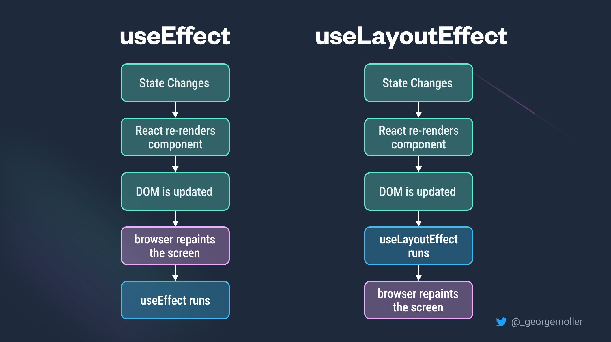

<div style="font-size: 17px;background: black;padding: 2rem;">

# useMemo

<b>The useMemo hook is a built-in hook provided by React that is used to memoize (cache) the result of a computation. When we use `useMemo`, React will only recompute the memoized value when the dependencies you specify have changed. If the dependencies have not changed, React will return the cached value</b>

Here's the basic syntax of the useMemo hook:

```js
const memoizedValue = useMemo(callbackFunction, [dependency1, dependency2, ...]);
```

- `computeValue`: A function that calculates the value you want to memoize.
- `dependency1, dependency2, ...`: An array of values that the memoized value depends on. If any of these values change, the memoized value will be recomputed; otherwise, the cached version will be returned.

<b style="color:red;">NOTE</b>: Remember that value which gets stored in `memoizedValue` will be returned value of `callbackFunction`, not the function itself. This is the basic difference between `useCallback` & `useMemo` hook.

Usage of this hook:

<h3 style="border-bottom: 2px solid white; padding-bottom: 2px; display: inline-block;">1. Skipping expensive recalculations</h3>

To cache a calculation between re-renders, wrap it in a useMemo call at the top level of your component:

```js
import { useMemo } from "react";

function TodoList({ todos, tab, theme }) {
  const visibleTodos = useMemo(() => filterTodos(todos, tab), [todos, tab]);
  // ...
}
```

You need to pass two things to useMemo:

1. A calculation function that takes no arguments, like () =>, and returns what you wanted to calculate.
2. A list of dependencies including every value within your component that’s used inside your calculation.

On the initial render, the value you’ll get from useMemo will be the result of calling your calculation.

On every subsequent render, React will compare the dependencies with the dependencies you passed during the last render. If none of the dependencies have changed (compared with <a href="https://developer.mozilla.org/en-US/docs/Web/JavaScript/Reference/Global_Objects/Object/is">Object.is</a>), useMemo will return the value you already calculated before. Otherwise, React will re-run your calculation and return the new value.

In other words, useMemo caches a calculation result between re-renders until its dependencies change.

<h3 style="border-bottom: 2px solid white; padding-bottom: 2px; display: inline-block;">2. Skipping re-rendering of components</h3>

In some cases, useMemo can also help you optimize performance of re-rendering child components. Consider below code:

```js
// Parent component
export default function TodoList({ todos, tab, theme }) {
  // Every time the theme changes, this will be a different array...
  const visibleTodos = filterTodos(todos, tab);
  return (
    <div className={theme}>
      {/* ... so List's props will never be the same, and it will re-render every time */}
      <List items={visibleTodos} />
    </div>
  );
}
```

```js
// Child component
import { memo } from "react";

const List = memo(function List({ items }) {
  // ...
});
```

You’d notice that toggling the theme prop freezes the app for a moment, but if you remove `<List />` from your JSX, it feels fast. This tells you that it’s worth trying to optimize the List component.

By default, when a component re-renders, React re-renders all of its children recursively. This is why, when TodoList re-renders with a different theme, the List component also re-renders. This is fine for components that don’t require much calculation to re-render. But if you’ve verified that a re-render is slow, you can tell List to skip re-rendering when its props are the same as on last render by wrapping it in memo.

With this change, List will skip re-rendering if all of its props are the same as on the last render. This is where caching the calculation becomes important! Imagine that you calculated visibleTodos without useMemo.

In the above example, the filterTodos function always creates a different array, similar to how the {} object literal always creates a new object. Normally, this wouldn’t be a problem, but it means that List props will never be the same, and your memo optimization won’t work. This is where useMemo comes in handy.

By wrapping the visibleTodos calculation in useMemo, you ensure that it has the same value between the re-renders (until dependencies change). You don’t have to wrap a calculation in useMemo unless you do it for some specific reason. In this example, the reason is that you pass it to a component wrapped in memo, and this lets it skip re-rendering.

<div style="background: DarkRed;  padding: 0.3rem 0.8rem;">Remember that only if those callback functions return objects(which includes functions as well in JS), then only their reference will change on render of component. Other data types like Number, Boolean, etc won't change on render of component which means it will be useless to memoize them just for the purpose of skipping re-render of child component.</div>

<h3 style="border-bottom: 2px solid white; padding-bottom: 2px; display: inline-block;">3. Memoizing a dependency of another Hook</h3>

Consider the below code:
```js
function Dropdown({ allItems, text }) {
  const searchOptions = { matchMode: "whole-word", text };
  // const searchOptions = useMemo(() => ({ matchMode: 'whole-word', text }), [text]);

  const visibleItems = useMemo(() => {
    return searchItems(allItems, searchOptions);
  }, [allItems, searchOptions]); // 🚩 Caution: Dependency on an object created in the component body
  // ...
}
```

Depending on an object like this defeats the point of memoization. When a component re-renders, all of the code directly inside the component body runs again. The lines of code creating the searchOptions object will also run on every re-render. Since searchOptions is a dependency of your useMemo call, and it’s different every time, React knows the dependencies are different, and recalculate searchItems every time.

To fix this, you could memoize the searchOptions object itself before passing it as a dependency. [REMEMBER THE 2nd POINT'S HIGHLIGHTED TEXT HERE AS WELL].

<br>

# useCallback

<b>`useCallback` is a built-in hook provided by React that will return a memoized version of the callback function that only changes if one of the dependencies has changed.</b>

Syntax of `useCallback` hook:

<span style="color: Chartreuse;">const memoizedCallback = useCallback(callbackFunction, dependencies);</span>

- `callbackFunction`: The function you want to memoize.
- `dependencies`: An array of values that the memoized function depends on. If any of these values change, the memoized function will be recreated; otherwise, the cached version will be returned.

Usage of this hook:

<h3 style="border-bottom: 2px solid white; padding-bottom: 2px; display: inline-block;">1. Skipping re-rendering of components </h3>

In React, when you pass a callback function to a child component as a prop, that callback function is recreated every time the parent component re-renders. This can be inefficient, especially if the child component relies on reference equality to determine whether the prop has changed. The `useCallback` hook solves this problem by allowing you to wrap a function in a memoized version, so that the function is only recreated when its dependencies change.

<b style="color:red;">React will compare each dependency with its previous value using the <a href="https://developer.mozilla.org/en-US/docs/Web/JavaScript/Reference/Global_Objects/Object/is">Object.is</a> comparison algorithm.</b>

Consider the given below code of Parent & Child components:

```js
// TestComponent.js (Parent Component)
import React, { useState } from "react";
import TestComponentChild from "./TestComponentChild";

const TestComponent = () => {
  const [firstName, setFirstName] = useState("");
  const [lastName, setLastName] = useState("");

  const handleFirstNameEnter = (e) => {
    setFirstName(e.target.value);
  };
  const handleLastNameEnter = (e) => {
    setLastName(e.target.value);
  };

  const getFirstName = () => firstName; // const getFirstName = useCallback(() => firstName, [firstName]);

  return (
    <>
      <input onChange={handleFirstNameEnter} value={firstName} />
      <input onChange={handleLastNameEnter} value={lastName} />
      <TestComponentChild getFirstName={getFirstName} />
    </>
  );
};

export default TestComponent;
```

```js
// TestComponentChild.js (Child Component)
import React from "react";

const TestComponentChild = ({ getFirstName }) => {
  console.log("TestComponentChild");
  return <span>{getFirstName()}</span>;
};

export default React.memo(TestComponentChild);
```

In parent component we are maintaining two states - one for first name and other for last name. And in child component we are passing a callback function prop which returns the first name. Now when first name state changes, child component is expected to re-render as it is receiving a callback function in prop which returns first name and it has to update its UI accordingly. But what we notice is that even when last name state is changed, child component still re-renders which is not required. This is happening because `getFirstName` function is recreated whenever parent component renders which changes its reference ultimately resulting in change of prop being passed to child component.

Now if we wrap `getFirstName` function with `useCallback` hook and add `firstName` in its dependency array, this function will be recreated only when `firstName` changes. That means on every re-render of parent component due to change of last name state, function will not be recreated thus preventing the unnecessary re-render of child component.

<b style="color:red;">NOTE</b>: When dependencies change, it is mandary to recreate the callback function in order to re-render the child component because it is rendering its UI based on the result of that function. So if we won't let it re-render, its UI will be based on previous value returned by the callback function.

<h3 style="border-bottom: 2px solid white; padding-bottom: 2px; display: inline-block;">2. Preventing an Effect from firing too often  </h3>

Imagine a scenario in which we are calling a function `fun` inside useEffect hook. We will have to add that function in dependency array of useEffect hook. Now if we don't wrap `fun` with `useCallback` hook, on every render of the component, useEffect will get fired unnecessarily because reference of `fun` will keep changing on every render.

```js
const TestComponent = () => {
const fun = () => {}; // const fun = useCallback(() => {}, []);
useEffect(() => { fun(); }, [fun]);
return null;
}
export default TestComponent;
```

<b style="color:red;">NOTE</b>: This is not just for useEffect hook. If any other hook is also using any callback function defined in same component, it should be wrapped with `useCallback` for same reason. Checkout below example:

```js
const fun = () => {}; // const fun = useCallback(() => {}, []); 
const fun2 = useCallback(() => {fun();}, [fun]);
```
Here, we have to wrap `fun` also with useCallback otherwise on re-render, it will be recreated thus changing its reference which will ultimately recreate `fun2` and wrapping it with `useCallback` will become useless.

<h3 style="border-bottom: 2px solid white; padding-bottom: 2px; display: inline-block;">3. Optimizing a custom Hook</h3>
If you’re writing a custom Hook, it’s recommended to wrap any functions that it returns into useCallback:

```js
function useRouter() {
  const { dispatch } = useContext(RouterStateContext);

  const navigate = useCallback((url) => {
    dispatch({ type: 'navigate', url });
  }, [dispatch]);

  const goBack = useCallback(() => {
    dispatch({ type: 'back' });
  }, [dispatch]);

  return {
    navigate,
    goBack,
  };
}
```
This ensures that the consumers of your Hook can optimize their own code when needed.


<br>

# useLayoutEffect

`useLayoutEffect` is a hook in React that is quite similar to `useEffect`, but with a critical difference: runs <b style="color: Chartreuse;">synchronously</b> after all DOM mutations. This makes it suitable for tasks that require immediate access to the DOM or need to perform operations before the browser paints the screen.

<br>

See this code:

```js
import React, { useLayoutEffect, useState } from "react";

const TestComponent = () => {
  const [number, setNumber] = useState(1);
  const [isEven, setIsEven] = useState(false);

  // For slowing down rendering
  let now = performance.now(); 
  while (performance.now() - now < 300) {
    // do nothing
  }

  useLayoutEffect(() => {
    if (number % 2 === 0) setIsEven(true);
    else setIsEven(false);
  }, [number]);

  return (
    <>
      <h1>Number = {number}</h1>
      <h1>isEven = {isEven.toString()}</h1>
      <button
        onClick={() => {
          setNumber(number + 1);
        }}
      >
        Increase number
      </button>
    </>
  );
};

export default TestComponent;
```

Here if we will use `useEffect`, first number will increase and then its even/odd status change because hook's code will run after screen has been painted. While if we use `useLayoutEffect`, first hook's code will run and then screen will be painted. See this video with same example - <a href="https://www.youtube.com/shorts/XuoRY_NomnA">Link</a>

<h3 style="border-bottom: 2px solid white; padding-bottom: 2px; display: inline-block;">Use Cases:</h3>

- <span style="color: Cyan;">DOM Measurements and Manipulations:</span> Since it runs after DOM mutations but before painting, useLayoutEffect is suitable for tasks that require measurements or manipulations of the DOM, such as calculating the size or position of elements.
- <span style="color: Cyan;">Synchronizing Layout Effects:</span> When you need to ensure that some code runs synchronously after DOM mutations, useLayoutEffect is a good choice.
- <span style="color: Cyan;">Animation and Transitions:</span> It's often used in animation or transition libraries to ensure that changes are applied synchronously to prevent flickering or janky animations.

<div style="border: 1px solid yellow; padding: 10px;background: red; color: black; font-weight: bold;">

Since `useLayoutEffect` runs synchronously and can potentially block the main thread, it's crucial to ensure that the code inside it is optimized and doesn't cause performance bottlenecks. Avoid performing expensive operations inside `useLayoutEffect`, as it could lead to janky UI or poor user experience. Prefer `useEffect` when possible.
</div>

</div>

<!-- <div style="font-size: 17px;background: black;padding: 2rem;"> -->
<!-- <div style="background: DarkRed;padding: 0.3rem 0.8rem;"> [HIGHLIGHT] -->
<!-- <h3 style="border-bottom: 2px solid white; padding-bottom: 2px; display: inline-block;"> [SUBHEADING] -->
<!-- <b style="color: Chartreuse;"> [NOTE] -->
<!-- <b style="color:red;"> [NOTE-2] -->
<!-- <span style="color: Cyan;"> [IMP] -></span> -->
<!-- <b style="color: Salmon;"> [POINT] -->
<!-- <div style="border: 1px solid yellow; padding: 10px;"> [BORDER] -->
