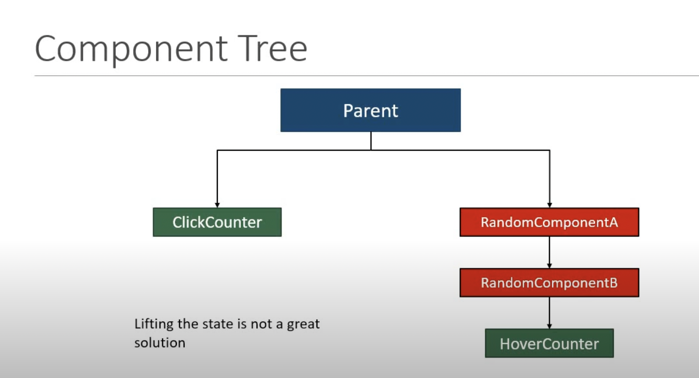

<div style="font-size: 17px;background: black;padding: 2rem;">

A higher-order component (HOC) is an advanced technique in React for reusing component logic. HOCs are not part of the React API, per se. They are a pattern that emerges from React’s compositional nature.

Concretely, <b>a higher-order component is a function that takes a component and returns a new component.</b>

```js
const EnhancedComponent = higherOrderComponent(WrappedComponent);
```

The main idea behind HOCs is to encapsulate and abstract common functionality or behavior that can be shared across multiple components. This helps in reusing code, separating concerns, and keeping components focused on their specific tasks.

Suppose we have to make two components. One has a simple heading which tells the number of times we hovered over it and other one has a simple button which says the number of times we clicked it. What we can do is create counter state initialised to 0 for both of them which increases on hover and click events respectively. We can observe that counter functionality is being duplicated. 

Lifting the state will work in this scenario but if components which need the functionality are deeply nested, state lifting will not be good idea.

<br>

<b>Here comes HIGHER ORDER COMPONENT into picture!!</b>

```js
// withIncrementor.js -> Higher Order Component
import React, { useState } from "react";
const withIncrementor = (OriginalComponent) => { //HOC could also receive second argument
  const NewComponent = (props) => { 
    const [count, setCount] = useState(1);
    const incrementCount = () => {
      setCount((prevCount) => prevCount + 1);
    };
    return (
      <OriginalComponent
        count={count}
        incrementCount={incrementCount}
        {...props}
      />
    );
  };
  return NewComponent;
};
export default withIncrementor;
```

```js
// HoverCounter.js
import React from "react";
import withIncrementor from "./withIncrementor";

const HoverCounter = (props) => {
  const { count, incrementCount, subComponentName } = props;
  return (
    <h2 onMouseOver={incrementCount}>
      {subComponentName}: Hovered {count} times on me!
    </h2>
  );
};

export default withIncrementor(HoverCounter);
```

```js
// ClickCounter.js
import React from "react";
import withIncrementor from "./withIncrementor";

const ClickCounter = (props) => {
  const { count, incrementCount, subComponentName } = props;
  return (
    <button onClick={incrementCount}>
      {subComponentName}: Clicked {count} times on me!
    </button>
  );
};

export default withIncrementor(ClickCounter);
```

We are simply wrapping `HoverCounter` and `ClickCounter` with `withIncrementor` HOC which has the functionality of incrementing counter.

Higher Order Components are powerful tools in React, but with the introduction of hooks and more advanced patterns like Render Props and Context API, their usage has somewhat diminished. Still, understanding HOCs can provide valuable insights into component composition and code reusability in React applications.
</div>

<!-- <div style="background: DarkRed;  padding: 0.3rem 0.8rem;"> => HIGHLIGHT -->
<!-- <h3 style="border-bottom: 2px solid white; padding-bottom: 2px; display: inline-block;"> => SUBHEADING -->
<!-- <b style="color: Chartreuse;"> => IMPORTANT-1 -->
<!--  => IMPORTANT-2 -->
<!-- <mark style="padding: 0.3rem 0.8rem;"> => IMPORTANT-3 -->
<!-- <b> => IMPORTANT-5 -->
<!-- <b style="color:red;"> => NOTE -->
<!-- <br><span style="color: Cyan;">-></span> -->
