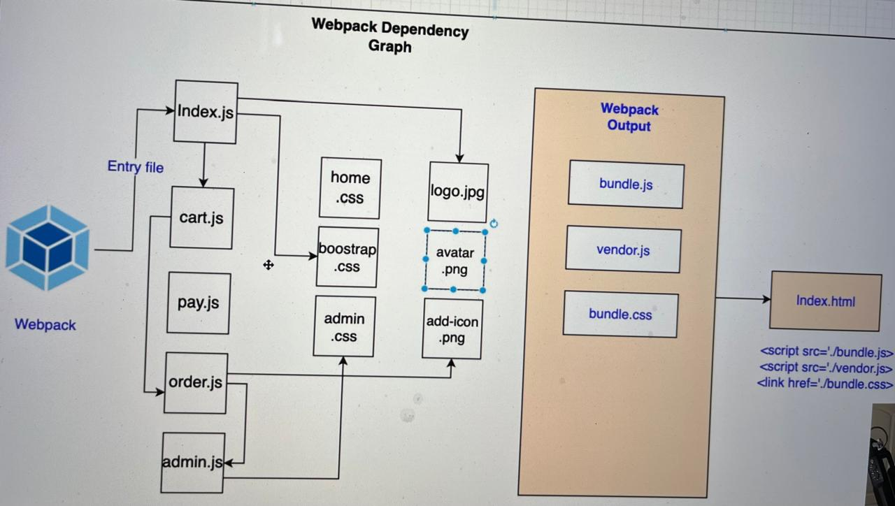
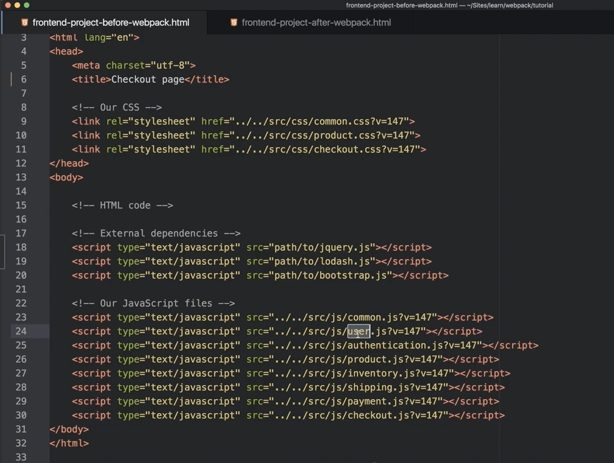

<div style="font-size: 17px;background: black;padding: 2rem;">

As its core, webpack is a <b style="color:DarkKhaki;"><u>static module bundler</u></b>. In a particular project, webpack treats all files and assets as modules. Under the hood, it relies on a <b style="color:Magenta;"><u>dependency graph</u></b>. A dependency graph describes how modules relate to each other using the references (`require` and `import` statements) between files. In this way, webpack statically traverses all modules to build the graph, and uses it to generate a single bundle (or several bundles) — a JavaScript file containing the code from all modules combined in the correct order. “Statically” means that, when webpack builds its dependency graph, it doesn’t execute the source code but stitches modules and their dependencies together into a bundle. This can then be included in your HTML files.

<br>

Let's break down some important terminologies used above for better understanding:

- **BUNDLER**: When you're building a website, you often have many separate files containing JavaScript, CSS, images, and other assets. A bundler takes all these separate files and combines them into fewer files, or "bundles". This can improve performance by reducing the number of HTTP requests a browser needs to make to render your web page.
- **DEPENDENCY GRAPH**: Any time one file depends on another, webpack treats this as a <u>dependency</u>. This allows webpack to take non-code assets, such as images or web fonts, and also provide them as dependencies for your application. When webpack processes your application, it starts from a list of modules defined on the command line or in its configuration file. Starting from these `entry points`, webpack recursively builds a <u>dependency</u> graph that includes every module your application needs, then bundles all of those modules into a small number of bundles - often, only one - to be loaded by the browser.

<h3 style="border-bottom: 2px solid white; padding-bottom: 2px; display: inline-block;">Why Webpack?</h3>

1. Modern applications rely on numerous libraries and modules (like below image). Manually managing dependencies and their load order (e.g., Lodash, jQuery) was tedious and error-prone. Webpack automatically handles dependencies, ensuring everything is loaded in the correct order.
2. Early web development encouraged combining CSS, JavaScript, and HTML in large files. Webpack enables developers to break their code into smaller, reusable modules while still bundling them into a single efficient file for production. It reduced the number of HTTP requests that is crucial for performance.
3. Modern JavaScript (e.g., ES6/ESNext) isn't natively supported by all browsers. Webpack integrates with tools like Babel to transpile code into a compatible version for older browsers.
4. Webpack includes features like `Hot Module Replacement (HMR)` - used for reloading parts of the app without refreshing the browser and development servers - used for running a local server for easier development
5. Applications often require more than just JavaScript, including CSS, images, fonts, and JSON. Webpack provides loaders to preprocess and bundle these assets together.
6. Webpack treats every file in your web application (.css, .html, .png, etc.) as a module, making it easier to manage all assets within the JavaScript ecosystem.

<br>

<h3 style="border-bottom: 2px solid white; padding-bottom: 2px; display: inline-block;">Webpack Installation</h3>

Other than `webpack`, we need to install one more package called `webpack-cli` to use Webpack from the command line (we'll be prompted to install it if we don't). It's functionality in brief:

- `webpack-cli` is a <u>**command-line interface**</u> for Webpack, which is the tool you use to interact with Webpack from the command line. It allows you to run Webpack from the command line with commands like `webpack` or `webpack serve`.
- It can read the configuration from a `webpack.config.js` file or from the command line itself, offering flexibility in how you set up your Webpack environment.
- Provides various options to customize the build process, like `--config` for specifying a custom config file, `--output-path` for where to output the bundle, `--analyze` for performance analysis, or `--mode` for specifying whether to set the mode.

Depending on project's needs, we'll likely need additional loaders and plugins.

```
npm install webpack webpack-cli --save-dev
```

<span style="color:Orange;">Each and everything that we are going to install related to webpack should be installed as dev dependency becaus they are only going to help in building the application, not in running it on production.</span>

<h3 style="border-bottom: 2px solid white; padding-bottom: 2px; display: inline-block;">Webpack Configuration</h3>

Webpack stores it's configuration in a JavaScript file (typically named `webpack.config.js`) that instructs Webpack on how to process your project's code and assets. It provides essential details about your project's structure, dependencies, and desired output. If we don't create it, webpack uses it's default one. This file is basically a JavaScript module. Webpack expects this module to export the configuration object. Remember that we have to use old way of importing and exporting in this file (common js) and not ES6 modules. It was always like this and it's still the case in Webpack 5.

<h3 style="border-bottom: 2px solid white; padding-bottom: 2px; display: inline-block;">Running webpack</h3>

Executing the command `webpack` directly won't work unless we install webpack globally. Hence, we use `npx`. If a configuration file is created, webpack command followed by `--config` option and the path to configuration file is used.

```bash
npx webpack --config webpack.custom.js
```

To make it more convenient, we can add a script to `package.json` file to run webpack with our custom configuration.

```json
{
  "scripts": {
    "build": "webpack --config webpack.custom.js"
  }
}
```

If we run the webpack command without specifying a `--config` option, webpack looks for a default configuration file named `webpack.config.js` in the root directory of your project. If this file exists, webpack will automatically use it without the need for the `--config` command like this:

```bash
npx webpack
```

If there is no webpack configuration file, webpack will create bundles with default configuration.

<br>

# Webpack Main Concepts

Webpack has some main concepts which we need to understand clearly before digging in its practical implementation. Let’s examine them one by one:

## ENTRY

An entry point indicates which module webpack should use to begin building out its dependency graph. Webpack starts from these entry points, traces all dependencies, and then bundles these into one or more output files. By default its value is `./src/index.js`, but you can specify a different (or multiple) entry points by setting an <b style="color: Cyan;">entry</b> property in the webpack configuration.

<h3 style="border-bottom: 2px solid white; padding-bottom: 2px; display: inline-block;">Types of entry points</h3>

<b style="color:SpringGreen;">1. Single Entry (String Syntax): </b>Ideal for simple applications or libraries where you have one main file from which all dependencies are resolved. This method is straightforward but less flexible for complex setups.

```js
module.exports = {
  entry: './path/to/my/entry/file.js',
};
```

<b style="color:SpringGreen;">2. Multi-Main Entry (Array Syntax): </b>This "multi-main entry" allows you to inject multiple dependent files together, merging their dependency graphs into a <span style="color: Gold;">single bundle</span>. Useful when you have several scripts that should be bundled together but don't have a single entry file.

```js
module.exports = {
  entry: ['./src/file_1.js', './src/file_2.js'],
  output: {
    filename: 'bundle.js',
  },
};
```

<b style="color:SpringGreen;">3. Object Syntax: </b>This is the most flexible and scalable method. Each key in the object represents a separate entry point, which results in <span style="color: Gold;">multiple bundles</span>. This is particularly useful for making Multiple Page Applications (MPAs).

<span style="color: Crimson;">Note that whenever we are using the term vendor, it means third party libraries</span>

```js
module.exports = {
  entry: {
    home: './src/home.js',
    about: './src/about.js',
  },
};
```

<h3 style="border-bottom: 2px solid white; padding-bottom: 2px; display: inline-block;">Advanced Entry Configurations</h3>

<b style="color:Salmon;">Descriptor Syntax:</b> Introduced in Webpack 5, this allows more control over how each entry point is handled:

```js
module.exports = {
  entry: {
    app: {
      import: './src/app.js',
      dependOn: 'vendors', // This entry depends on the 'vendors' chunk
      filename: 'myapp.js', // Custom filename for this entry
    },
    vendors: ['react', 'react-dom'], // A chunk for vendor libraries
  },
};
```

**PROPERTIES:**

- `import:` Specifies what to import.
- `dependOn:` The entry points that the current entry point depends on. They must be loaded before this entry point is loaded.
- `filename:` Customizes the output filename for this entry.
- `runtime:` Determines if a new runtime chunk should be created for this entry.
- `chunkLoading:` Specifies how chunks are loaded (e.g., `'jsonp'` for dynamic imports).

<b style="color:Salmon;">Dynamic Entry Points:</b> You can use functions for dynamic entries:

```js
module.exports = {
  entry: () => './dynamic-entry.js',
  // or for async scenarios:
  // entry: () => new Promise((resolve) => resolve(['./dynamic-entry.js']))
};
```

<h3 style="border-bottom: 2px solid white; padding-bottom: 2px; display: inline-block;">Separate App and Vendor Entries</h3>

```js
module.exports = {
  entry: {
    main: './src/app.js',
    vendor: './src/vendor.js',
  },
};
```

**What does this do?** We are telling webpack that we would like 2 separate entry points (like the above example).

**Why?** With this, you can import required libraries or files that aren't modified (e.g. Bootstrap, jQuery, images, etc) inside `vendor.js` and they will be bundled together into their own chunk. Content hash remains the same, which allows the browser to cache them separately thereby reducing load time.

<h3 style="border-bottom: 2px solid white; padding-bottom: 2px; display: inline-block;">Multi-Page Application
</h3>

```js
module.exports = {
  entry: {
    pageOne: './src/pageOne/index.js',
    pageTwo: './src/pageTwo/index.js',
    pageThree: './src/pageThree/index.js',
  },
};
```

Here, we are telling webpack that we would like 3 separate dependency graphs (like the above example). In a multi-page application, the server is going to fetch a new HTML document for you. The page reloads this new document and assets are redownloaded. However, this gives us the unique opportunity to do things like using `optimization.splitChunks` to create bundles of shared application code between each page. Multi-page applications that reuse a lot of code/modules between entry points can greatly benefit from these techniques, as the number of entry points increases.

<span style="color: gold;">As a rule of thumb, for each HTML page, there should be one entry point. This avoids unnecessary loading of assets.</span>

<br>

## OUTPUT

This property is used to specify how and where Webpack should emit the compiled assets. It defaults to `./dist/main.js`. This part of the process can be configured by specifying an <b style="color: Cyan;">output</b> field in your configuration, which is an object that contains several sub-properties, each controlling different aspects of the output:

1. <span style="color: SpringGreen;">path</span>: Specifies the directory where all output files are placed. Also, <span style="color: Coral;">it must be an absolute path</span>. Webpack won't create this directory if it doesn't exist.

2. <span style="color: SpringGreen;">filename</span>: Defines the name of the output file or files for entry points. Note this option is called `filename` but you are still allowed to use something like `'js/[name]/bundle.js'` to create a folder structure to separate out js bundles from other bundles like css. If the configuration creates multiple bundles, one should use `substitutions` to ensure that each file has a unique name. These substitutions are replaced with dynamic values during the bundling process, resulting in more informative and flexible file names for your output bundles. Here are some common substitutions you can use:

   - `[name]`: Entry point name
   - `[id]`: Chunk ID
   - `[hash]`: Compilation hash
   - `[chunkhash]`: Chunk-specific hash
   - `[contenthash]`: The hash of the chunk, including only elements of this content type.

   <b style="color:red;">NOTE:</b> This option does not affect output files for on-demand-loaded chunks. It only affects output files that are initially loaded. For on-demand-loaded chunk files, the <span style="color: HotPink;">output.chunkFilename</span> option is used. Files created by loaders also aren't affected. In this case, you would have to try the specific loader's available options.

3. <span style="color: SpringGreen;">clean</span>: Clean the output directory before emit if passed `true`.
4. <span style="color: SpringGreen;">publicPath</span> (🚨<a href="https://www.youtube.com/watch?v=oSOPsRbBiIU"> Video Explanation</a>): This property is used to specify the base path for all assets within your application. It determines the location where the bundled files will be available in the browser. This is particularly important for <u>dynamically loaded assets</u> like images, stylesheets, and JavaScript files. It tells Webpack and the browser where to find these assets. When the application dynamically loads chunks or assets, Webpack uses the `publicPath` to construct the URL from which these assets are served. This is essential for applications that use code splitting or lazy loading. Essentially, every file emitted to `output.path` directory will be referenced from the `output.publicPath` location. This includes child chunks (created via code splitting) and any other assets (e.g. images, fonts, etc.) that are a part of dependency graph. If we want to serve assets from a Content Delivery Network (CDN) or a different server, we can set the `publicPath` to the URL of the CDN. Webpack automatically replaces references to assets with URLs based on the `publicPath`. This ensures that all asset requests are directed to the CDN rather than your main server. Absolute paths are commonly used for CDNs or when the assets are served from a different domain or server while relative paths are useful when assets are served from the same domain but a different sub-directory.
   - <span style="color: Gold;">Root Directory ("/")</span>: This configuration implies that the assets are served from the root of the server.
   - <span style="color: Gold;">Sub-Directory ("/assets/")</span>: This configuration implies that the assets are served from a sub-directory `'/assets/'`.
   - <span style="color: Gold;">CDN url</span>: This configuration implies that the assets are served from a CDN.

<br>

```js
// webpack.config.js;
const path = require('path');

module.exports = {
  entry: {
    app: './src/app.js',
    search: './src/search.js',
  },
  output: {
    filename: '[name].js',
    path: __dirname + '/dist',
  },
};

// writes to disk: ./dist/app.js, ./dist/search.js
```

<div style="border: 2px solid crimson; padding: 10px;">

The `path` module used is a built-in `Node.js` module that provides utilities for working with file and directory paths. `__dirname` is a `Node.js` global variable that represents the directory name of the current module (i.e., the directory in which the current JavaScript file resides). The `path.resolve` method resolves a sequence of paths or path segments into an absolute path. It computes the absolute path by processing each given sequence from right to left, prepending each segment until an absolute path is constructed.

</div>

<br>

## MODES

This property is a key setting that influences how Webpack behaves during compilation. By setting the <b style="color: Cyan;">mode</b> parameter to either <span style="color: Yellow;">development</span>, <span style="color: Yellow;">production</span> or <span style="color: Yellow;">none</span>, you can enable webpack's built-in optimizations that correspond to each environment. This setting can affect build performance, output, and even the behavior of some plugins and loaders. The default value is `production`. Here are the core aspects influenced by `mode`:

- **Optimization Levels:** Controls whether certain optimizations like minification, scope hoisting, or tree shaking are applied.
- **Default Values:** Sets default values for various Webpack options that are helpful for the specified environment.
- **Logging:** Affects the level of detail in logging and error reporting.

<b style="color: springgreen">Development mode:</b>

- Optimizes the build for faster rebuilds and better debugging during development.
- Enables useful error messages.
- Sets <span style="color: Gold;">process.env.NODE_ENV</span> to <span style="color: HotPink;">development</span> for conditional compilation.
- Modules and chunks are named for better debugging. This helps to identify which files are being processed.
- JavaScript is not minified, which makes it easier to read and debug.
- Source maps are enabled by default (`devtool: 'eval-cheap-module-source-map'`) which generates high-quality, fast source maps that are suitable for development but not for production.

<b style="color: springgreen">Production mode:</b>

- Optimizes the build for deployment to a production environment by focusing on performance by delivering the smallest possible bundle size. It does this by following ways:
  - Minification of JavaScript (using <span style="color: Violet;">TerserWebpackPlugin</span> by default).
  - Tree shaking (dead code elimination) for ECMAScript modules.
  - Scope hoisting to reduce module overhead.
- Sets <span style="color: Gold;">process.env.NODE_ENV</span> to <span style="color: HotPink;">production</span> for conditional compilation.
- `devtool: 'source-map'`is set that generates source maps that are more suitable for production, helping to debug without revealing full source code.

<b style="color: springgreen">None mode:</b>

- Disables all built-in optimizations. This is a bare-bones configuration where you explicitly define all optimizations.
- No optimizations are applied.
- Useful for highly customized builds where default optimizations are not desired.

```js
// webpack.config.js
module.exports = {
  mode: 'development', // Can take 'development', 'production' and 'none' as its value
  entry: './src/index.js',
  output: {
    filename: 'bundle.js',
    path: path.resolve(__dirname, 'dist'),
  },
};
```

<br>

## TARGET

The <b style="color: Cyan;">target `(object)`</b> configuration option in Webpack specifies the environment in which the output bundle will run. This influences how Webpack processes and bundles the code, including the built-in libraries it provides and the way it handles certain features. Depending on the target, Webpack adjusts the output to be compatible with the specific environment, such as a web browser, Node.js, or an Electron application.

Available values for this option:

- <span style="color: Gold;">web</span>: The default target. Optimizes the bundle for web browsers. Use this for applications that run in a web browser.
- <span style="color: Gold;">node</span>: Optimizes the bundle for `Node.js` environments. Uses `Node.js` require to load chunks.

Similarly there are many more targets! And custom ones can also be created! Can be explored but not needed much!

</div>
