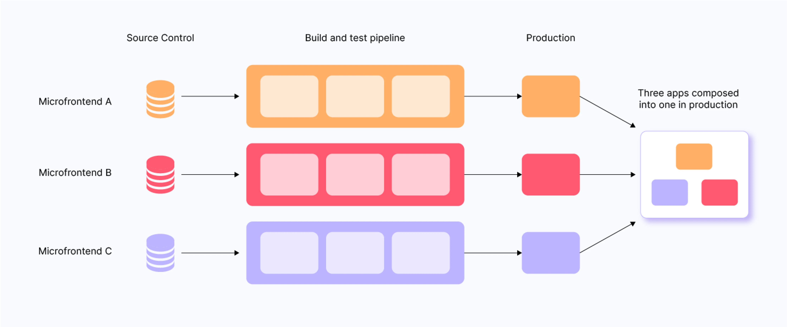
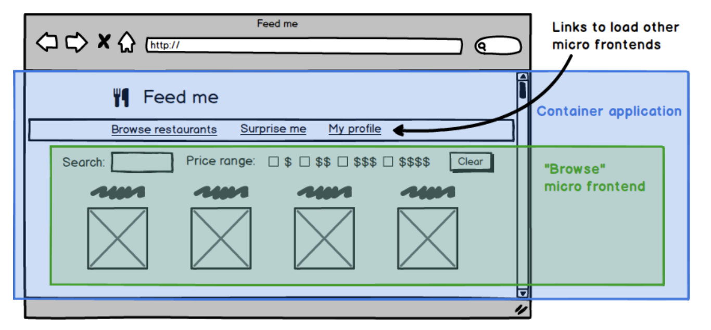

<div style="font-size: 17px;background: black;padding: 2rem;">

<b><a href="https://martinfowler.com/articles/micro-frontends.html">MICROFRONTENDS SMALL THEORY</a></b>

Microfrontend is an architectural style where a web application is divided into small, independently deployable frontend components or modules. Each module is developed and maintained by different teams, often using different technologies, but collectively they function as a single application.

<h3 style="border-bottom: 2px solid white; padding-bottom: 2px; display: inline-block;">Key Principles of Microfrontend:</h3>

<b style="color:Khaki;">1. Independence:</b> Each microfrontend operates independently, handling its own functionality, state management, and rendering.<br>
<b style="color:Khaki;">2. Technology Agnostic:</b> Different microfrontends can use different frameworks or libraries (e.g., React, Angular, Vue.js).<br>
<b style="color:Khaki;">3. Autonomous Deployment:</b> Each microfrontend can be built, tested, and deployed independently.<br>
<b style="color:Khaki;">4. Composition:</b> The main application integrates these smaller frontends dynamically, often during runtime, using techniques like iframes, Web Components, or JavaScript imports.

<br>

<br>

# BENEFITS OF MICROFRONTEND

<h3 style="border-bottom: 2px solid white; padding-bottom: 2px; display: inline-block;">1. Incremental upgrades</h3>

Micro frontends enable a gradual transition away from monolithic frontends. By isolating features into independent units, we can incrementally modernize our tech stack, experiment with new technologies, and deliver features faster while minimizing the risk of a full rewrite. This approach provides greater flexibility and allows for more independent upgrades and experimentation.

<h3 style="border-bottom: 2px solid white; padding-bottom: 2px; display: inline-block;">2. Simple, decoupled codebases</h3>

Micro frontends lead to smaller, more manageable codebases with reduced coupling between components. This encourages cleaner code by making it harder to introduce unintended dependencies between parts of the application.

By promoting explicit communication and data flow between components, micro frontends guide developers towards better architectural decisions and discourage accidental complexity.

<h3 style="border-bottom: 2px solid white; padding-bottom: 2px; display: inline-block;">3. Independent deployment</h3>

Micro frontends prioritize independent deployability. Each micro frontend has its own dedicated pipeline, enabling teams to release updates independently, regardless of other teams' progress. This reduces deployment risk and empowers teams to make their own release decisions, fostering faster innovation and greater autonomy.

<h3 style="border-bottom: 2px solid white; padding-bottom: 2px; display: inline-block;">4. Autonomous teams</h3>

Micro frontends empower true team autonomy by allowing teams to own entire product features, from conception to delivery. By organizing teams around user-facing features (e.g., individual pages), rather than technical concerns, teams gain greater ownership and responsibility, leading to increased agility and faster delivery of value to customers.

<br>

# METHODS OF IMPLEMENTING MICROFRONTEND

There are many approaches that could reasonably be called micro frontends. There is a fairly natural architecture that emerges across all of the approaches - generally there is a micro frontend for each page in the application, and there is a single <b style="color:HotPink;">container application</b>, which:

- Renders common page elements such as headers and footers.
- Addresses cross-cutting concerns like authentication and navigation.
- Brings the various micro frontends together onto the page, and tells each micro frontend when and where to render itself.

<br>

<h3 style="border-bottom: 2px solid white; padding-bottom: 2px; display: inline-block;">1. Server-Side Composition</h3>

In Server-Side Composition, the microfrontends are integrated at the server level. Each microfrontend produces an HTML fragment, and the server stitches these fragments together into a single page.

**WORKING:**

1. Individual teams host their microfrontends on separate servers or endpoints.
2. When a user requests a page, the server fetches the required HTML fragments from the respective microfrontends.
3. The server composes these fragments into a single HTML document and sends it to the client.

**ADVANTAGES:**

- <span style="color: SpringGreen;">SEO-Friendly:</span> Since the composition happens on the server, search engines receive fully rendered pages.
- <span style="color: SpringGreen;">Dynamic Composition:</span> Microfrontends can be included or excluded based on user preferences or request context.
- <span style="color: SpringGreen;">Faster Initial Load:</span> The server handles rendering, reducing the burden on the client’s browser.

**DISADVANTAGES:**

- <span style="color: SpringGreen;">Complex Orchestration:</span> Requires a robust server-side orchestration mechanism.
- <span style="color: SpringGreen;">Potential Latency:</span> Increased request latency if server-side composition involves many network calls.
- <span style="color: SpringGreen;">Harder Debugging:</span> Issues can arise from the orchestration layer, making debugging more challenging.

**BEST USE CASES:**

- Applications where SEO is critical, like e-commerce platforms or content-heavy websites.
- Scenarios where personalization or dynamic rendering is required.

<h3 style="border-bottom: 2px solid white; padding-bottom: 2px; display: inline-block;">2. Build Time Integration</h3>

One approach that we sometimes see is to publish each micro frontend as a package, and have the container application include them all as library dependencies. Here is how the container's package.json might look for our example app:

```json
{
  "name": "@feed-me/container",
  "version": "1.0.0",
  "description": "A food delivery web app",
  "dependencies": {
    "@feed-me/browse-restaurants": "^1.2.3",
    "@feed-me/order-food": "^4.5.6",
    "@feed-me/user-profile": "^7.8.9"
  }
}
```

**WORKING:**

1. Each team develops its part of the application (microfrontend) in isolation.
2. These parts are packaged into modules (e.g., npm packages or other library formats).
3. During the build process, the orchestrator (often a build tool like Webpack, Vite, or Rollup) combines these modules into one application.

**ADVANTAGES:**

- <span style="color: SpringGreen;">Performance Optimized:</span> Since all modules are bundled together at build time, the resulting application is highly optimized for performance.
- <span style="color: SpringGreen;">Simpler Runtime:</span> No runtime orchestration is required since everything is pre-integrated.
- <span style="color: SpringGreen;">Uniformity:</span> Ensures consistency in versioning and shared dependencies.

**DISADVANTAGES:**

- <span style="color: SpringGreen;">Republishing repeatedly:</span> This approach means that we have to re-compile and release every single micro frontend in order to release a change to any individual part of the product.
- <span style="color: SpringGreen;">Lack of Autonomy:</span> Teams cannot independently deploy updates. Any change requires rebuilding the entire application.
- <span style="color: SpringGreen;">Tight Coupling:</span> Dependencies across modules must be carefully managed to avoid conflicts.

**<u>We should find a way to integrate our micro frontends at run-time, rather than at build-time.**</u>

**BEST USE CASES:**

- Applications with relatively static modules where changes are infrequent.
- Teams that prioritize performance and don’t require independent deployments.

<h3 style="border-bottom: 2px solid white; padding-bottom: 2px; display: inline-block;">3. Run-time integration via iframes</h3>

This approach leverages iframes to isolate microfrontends, where each module runs within its own iframe.

**WORKING:**

1. Each microfrontend is deployed as an independent application, accessible via a URL.
2. The shell application integrates these microfrontends using iframes.
3. Communication between iframes is managed through postMessage or shared storage.

```html
<html>
  <head>
    <title>Feed me!</title>
  </head>
  <body>
    <h1>Welcome to Feed me!</h1>

    <iframe id="micro-frontend-container"></iframe>

    <script type="text/javascript">
      const microFrontendsByRoute = {
        '/': 'https://browse.example.com/index.html',
        '/order-food': 'https://order.example.com/index.html',
        '/user-profile': 'https://profile.example.com/index.html',
      };

      const iframe = document.getElementById('micro-frontend-container');
      iframe.src = microFrontendsByRoute[window.location.pathname];
    </script>
  </body>
</html>
```

**ADVANTAGES:**

- <span style="color: SpringGreen;">Complete Isolation:</span> Each microfrontend is sandboxed, preventing style or script interference.
- <span style="color: SpringGreen;">Ease of Integration:</span> Simple to integrate legacy or third-party applications.

**DISADVANTAGES:**

- <span style="color: SpringGreen;">Performance Issues:</span> Increased resource usage and slower interactions due to iframe overhead.
- <span style="color: SpringGreen;">Limited Communication:</span> Cross-iframe communication is less efficient and harder to manage.
- <span style="color: SpringGreen;">Poor User Experience:</span> Navigational consistency may be challenging.

**BEST USE CASES:**

- Applications requiring strict isolation, such as embedding third-party or legacy systems.
- Multi-tenant applications where different tenants have their own frontends.

<h3 style="border-bottom: 2px solid white; padding-bottom: 2px; display: inline-block;">4. Run-time integration via JavaScript (Client-Side Composition)</h3>

In Client-Side Composition, the integration of microfrontends happens in the user's browser. A shell application fetches and renders the required microfrontends at runtime.

Each micro frontend is included onto the page using a `<script>` tag, and upon load exposes a global function as its entry-point. The container application then determines which micro frontend should be mounted, and calls the relevant function to tell a micro frontend when and where to render itself.

**WORKING:**

1. The shell or container application acts as the entry point for the user.
2. At runtime, the shell fetches individual microfrontends as JavaScript bundles or modules.
3. The shell mounts these modules into predefined placeholders on the page.

```html
<html>
  <head>
    <title>Feed me!</title>
  </head>
  <body>
    <h1>Welcome to Feed me!</h1>

    <!-- These scripts don't render anything immediately -->
    <!-- Instead they attach entry-point functions to `window` -->
    <script src="https://browse.example.com/bundle.js"></script>
    <script src="https://order.example.com/bundle.js"></script>
    <script src="https://profile.example.com/bundle.js"></script>

    <div id="micro-frontend-root"></div>

    <script type="text/javascript">
      // These global functions are attached to window by the above scripts
      const microFrontendsByRoute = {
        '/': window.renderBrowseRestaurants,
        '/order-food': window.renderOrderFood,
        '/user-profile': window.renderUserProfile,
      };
      const renderFunction = microFrontendsByRoute[window.location.pathname];

      // Having determined the entry-point function, we now call it,
      // giving it the ID of the element where it should render itself
      renderFunction('micro-frontend-root');
    </script>
  </body>
</html>
```

**ADVANTAGES:**

- <span style="color: SpringGreen;">Independent Deployment:</span> Teams can deploy updates to their microfrontends without affecting others.
- <span style="color: SpringGreen;">Full Flexibility:</span> New features or modules can be added dynamically without rebuilding the entire app.
- <span style="color: SpringGreen;">Advantage over iframe:</span> Unlike with iframes, we have full flexibility to build integrations between our micro frontends however we like.
- <span style="color: SpringGreen;">Scalability:</span> Each microfrontend can be independently scaled based on its traffic.

**DISADVANTAGES:**

- <span style="color: SpringGreen;">Performance Overhead:</span> Increased number of HTTP requests and JavaScript parsing at runtime can slow down the initial load.
- <span style="color: SpringGreen;">Shared Dependencies:</span> Managing shared libraries and dependencies across microfrontends requires careful handling to avoid duplication or conflicts.

**BEST USE CASES:**

- Large-scale applications with distributed teams.
- Projects where runtime flexibility and independent deployment are critical.

<h3 style="border-bottom: 2px solid white; padding-bottom: 2px; display: inline-block;">5. Run-time integration via Web Components
</h3>

One variation to the previous approach is for each micro frontend to define an HTML custom element for the container to instantiate, instead of defining a global function for the container to call.

**WORKING:**

1. Teams develop microfrontends using the Web Components standard (Custom Elements, Shadow DOM, and HTML templates).
2. Each Web Component is distributed as a reusable component.
3. The main application imports and uses these components.

```html
<html>
  <head>
    <title>Feed me!</title>
  </head>
  <body>
    <h1>Welcome to Feed me!</h1>

    <!-- These scripts don't render anything immediately -->
    <!-- Instead they each define a custom element type -->
    <script src="https://browse.example.com/bundle.js"></script>
    <script src="https://order.example.com/bundle.js"></script>
    <script src="https://profile.example.com/bundle.js"></script>

    <div id="micro-frontend-root"></div>

    <script type="text/javascript">
      // These element types are defined by the above scripts
      const webComponentsByRoute = {
        '/': 'micro-frontend-browse-restaurants',
        '/order-food': 'micro-frontend-order-food',
        '/user-profile': 'micro-frontend-user-profile',
      };
      const webComponentType = webComponentsByRoute[window.location.pathname];

      // Having determined the right web component custom element type,
      // we now create an instance of it and attach it to the document
      const root = document.getElementById('micro-frontend-root');
      const webComponent = document.createElement(webComponentType);
      root.appendChild(webComponent);
    </script>
  </body>
</html>
```

The end result here is quite similar to the previous example, the main difference being that you are opting in to doing things 'the web component way'. If you like the web component spec, and you like the idea of using capabilities that the browser provides, then this is a good option. If you prefer to define your own interface between the container application and micro frontends, then you might prefer the previous example instead.

**ADVANTAGES:**

- <span style="color: SpringGreen;">Encapsulation:</span> Strong isolation of styles and functionality through Shadow DOM.
- <span style="color: SpringGreen;">Framework Agnostic:</span> Works seamlessly with any frontend framework or vanilla JavaScript.
- <span style="color: SpringGreen;">Long-Term Compatibility:</span> Built on web standards, ensuring compatibility across modern browsers.

**DISADVANTAGES:**

- <span style="color: SpringGreen;">Learning Curve:</span> Teams unfamiliar with Web Components may face a learning curve.
- <span style="color: SpringGreen;">Compatibility Issues:</span> Older browsers may require polyfills for support.
- <span style="color: SpringGreen;">Communication:</span> Requires custom mechanisms for cross-component communication.

**BEST USE CASES:**

- Applications requiring long-term maintainability and high encapsulation.
- Projects with heterogeneous technology stacks.

<h3 style="border-bottom: 2px solid white; padding-bottom: 2px; display: inline-block;">6. Module Federation (Webpack 5)</h3>

Module Federation allows microfrontends to expose and consume modules dynamically at runtime, as defined in Webpack 5.

**WORKING:**

1. Each microfrontend defines a Webpack configuration to expose its modules.
2. A shell application dynamically loads these modules using Webpack’s runtime.

**ADVANTAGES:**

- <span style="color: SpringGreen;">Dynamic Loading:</span> Modules can be updated or added without redeploying the entire app.
- <span style="color: SpringGreen;">Shared Dependencies:</span> Efficient handling of shared libraries to avoid duplication.
- <span style="color: SpringGreen;">Modern and Efficient:</span> Leverages modern tooling for optimized workflows.

**DISADVANTAGES:**

- <span style="color: SpringGreen;">Complex Configuration:</span> Requires expertise with Webpack and Module Federation.
- <span style="color: SpringGreen;">Dependency Conflicts:</span> Improper version management can lead to runtime issues.

**BEST USE CASES:**

- Modern applications prioritizing runtime flexibility and efficiency.
- Teams with strong expertise in Webpack.

<br>

# Ways by which microfrontends communicate

<div style="border: 1px solid yellow; padding: 10px; background-color: rgba(103, 114, 230, 0.2);">
One of the most common questions regarding micro frontends is how to let them talk to each other. In general, we recommend having them communicate as little as possible, as it often reintroduces the sort of inappropriate coupling that we're seeking to avoid in the first place.
</div>

<h3 style="border-bottom: 2px solid white; padding-bottom: 2px; display: inline-block;">1. URL-Based Communication</h3>

Microfrontends can communicate through the browser's URL. Each microfrontend updates the URL to reflect its state, and other microfrontends can respond to changes in the URL.

**MECHANISM:**

- Use query parameters, hash fragments, or the pathname.
- Leverage routing frameworks like React Router or Vue Router.

**USE CASE:** Navigation between microfrontends or passing lightweight data.

**EXAMPLE:**

- Microfrontend A changes the URL: `https://example.com/app1?user=123`.
- Microfrontend B listens for URL changes and reacts accordingly.

<h3 style="border-bottom: 2px solid white; padding-bottom: 2px; display: inline-block;">2. Custom Events</h3>

Microfrontends can dispatch and listen for custom events on the `window` or `document` object ->` window.dispatchEvent()` and `window.addEventListener()`.

Example:

```js
// Microfrontend A
const event = new CustomEvent('userLoggedIn', { detail: { userId: 123 } });
window.dispatchEvent(event);

// Microfrontend B
window.addEventListener('userLoggedIn', (event) => {
  console.log(event.detail.userId); // 123
});
```

<h3 style="border-bottom: 2px solid white; padding-bottom: 2px; display: inline-block;">3. Browser Storage (LocalStorage / SessionStorage)</h3>

Microfrontends can communicate by writing to `localStorage` or `sessionStorage` and listening for the storage event.

**USE CASE:** Passing persistent data like user preferences or authentication tokens.

```js
// Microfrontend A
localStorage.setItem('user', JSON.stringify({ id: 123 }));

// Microfrontend B
window.addEventListener('storage', (event) => {
  if (event.key === 'user') {
    console.log(JSON.parse(event.newValue)); // { id: 123 }
  }
});
```

<h3 style="border-bottom: 2px solid white; padding-bottom: 2px; display: inline-block;">4. API Gateway or Backend Communication</h3>

Microfrontends can communicate indirectly by interacting with a shared backend or API gateway. Each microfrontend makes API calls to the same backend services.

**EXAMPLE:**

1. Microfrontend A sends a `POST` request to `/api/session` to set a user session.
2. Microfrontend B fetches the session using a `GET` request to `/api/session`.

<h3 style="border-bottom: 2px solid white; padding-bottom: 2px; display: inline-block;">5. React specific approach</h3>

The React model of passing callbacks and data downwards (in this case downwards from the container application to the micro frontends) is also a good solution that makes the contract more explicit. 


</div>
