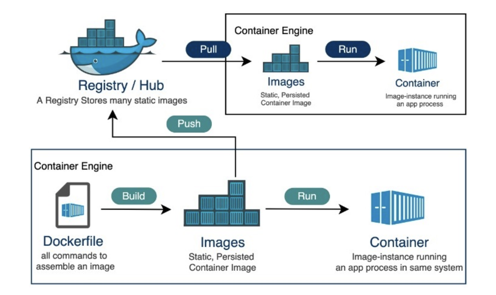

<div style="font-size: 17px;background: black;padding: 2rem;">

Docker is a platform that enables developers to build, ship, and run applications inside containers. Containers are lightweight, portable units that package an application along with its dependencies—such as libraries, tools, and runtime environments—into a single, isolated entity. Unlike traditional virtual machines, which require a full operating system and can be resource-intensive, Docker containers share the host system's kernel, making them more efficient and faster to deploy.

In the context of frontend development, Docker is particularly valuable for creating consistent and reproducible environments. Frontend developers often rely on specific tools and configurations, such as:
- A particular version of Node.js for running JavaScript applications.
- Package managers like npm or yarn.
- Build tools like Webpack, Vite, or Parcel.
- Environment variables for development, testing, or production.

Setting up these tools manually on every machine—whether it’s a developer’s laptop, a teammate’s computer, or a production server—can lead to inconsistencies (e.g., "It works on my machine, but not on yours"). Docker solves this by allowing developers to define the exact environment their frontend application needs in a container. Once defined, this container can run anywhere Docker is installed, ensuring the application behaves the same way across all environments.

For example, imagine you're building a React application. You might need Node.js 14, specific npm packages, and a development server running on port 3000. With Docker, you can create a container that encapsulates this setup. Whether you're developing locally, running tests in a CI/CD pipeline, or deploying to a server, the container ensures everything works consistently.

<div style="border: 1px solid yellow; padding: 10px; background-color: rgba(67, 92, 6, 0.47);">

If my application built on Node.js-18 is to be run on my friend's computer who has Node.js-16, Docker doesn’t “automatically install Node 18” it on his computer. Instead, it creates a container that includes Node.js 18 as part of its environment. This container is isolated from their local system, so their existing Node.js 18 installation remains unchanged.

To run app on his local machine, he'll have to install Docker on his machine and run `docker run` command. Then the app will start in the container and not his Node.js-16 runtime. If he doesn’t use Docker and wants to run your code directly on their machine (e.g., by typing `npm install` and `npm start` in their terminal), then they’d need Node.js 18 installed locally. That’s because, without Docker, their system’s Node.js version (16) would be used, and it might not support features or syntax your Node.js 18 code relies on.

In a production scenario (e.g., your app deployed on a server), Docker works similarly: the server runs a container with Node.js 18 based on your Dockerfile. Your friend wouldn’t “run” it locally—they’d access the deployed app (e.g., via a URL). But since you asked about running the code on local, I’m focusing on the development use case.
</div>

<h3 style="border-bottom: 2px solid white; padding-bottom: 2px; display: inline-block;">Traditional Deployment vs Docker Deployment</h3>

Let's look at a web application that was created using a particular Python version and a few third-party libraries. The required Python version, libraries, and environment configuration would need to be manually installed to deploy this application on a new server. It is necessary to repeat this procedure on each server, which can be laborious and prone to errors.

This is where Docker excels. Developers can use Docker to generate a container image that contains the application code together with all of its dependencies (particular libraries and versions of Python) and any setups that the system may require. After that, this image may be quickly installed on any host that has Docker installed.

By providing the container with an isolated environment, the Docker engine prevents problems with other programs or libraries on the host system. This saves developers a great deal of time and work because it not only makes deployment simpler but also ensures consistent behavior across all settings.

<h3 style="border-bottom: 2px solid white; padding-bottom: 2px; display: inline-block;">Key Concepts</h3>

<b style="color:DarkSalmon;">Containers:</b> They are lightweight, isolated environments that allow applications to run consistently across different environments. Containers package the application code, along with its dependencies, libraries, and configuration files, in a way that makes them portable across different systems. 

- Unlike Virtual Machines (VMs), containers share the host OS kernel, making them much smaller and faster to start and stop. This results in less overhead compared to VMs.
- Containers isolate the processes running inside them from other processes running on the host system. This isolation is achieved using technologies like Linux namespaces and cgroups.

<b style="color:DarkSalmon;">Docker Images:</b> A Docker image is a read-only, immutable template that contains the application code, its runtime, libraries, environment variables, and any necessary configuration files. It is the blueprint used to create Docker containers. Images are typically built using <span style="color:Yellow;">Dockerfile</span>, which describes the environment and setup instructions.

- Docker images are built in layers. Each command in a Dockerfile (e.g., `RUN`, `COPY`, `ADD`) adds a new layer on top of the previous one. These layers make images more efficient, as Docker caches layers and reuses them when building new images.
- Images can be shared via Docker registries (like Docker Hub) and run on any host that supports Docker.
- Each image can be tagged with a version, making it easy to roll back to previous versions if needed.

Docker images are read-only templates, so any changes you make to the running program happen inside a container, not to the image itself. By doing this, a clear division is maintained between the runtime state (container) and the application definition (image). In addition, since new versions may be made with targeted modifications without affecting already-existing containers, image versioning and maintenance are made simpler. 

<b style="color:DarkSalmon;">Dockerfile:</b> A Dockerfile is a script that contains a series of instructions to assemble a Docker image. It defines the steps needed to set up the application, such as installing dependencies, copying files, configuring environment variables, and setting the entry point for the container. It's a simple way to automate the image creation process. A typical Dockerfile for a frontend project might include steps like:

1. **Choosing a base image:** For a JavaScript-based frontend app, you might start with an official Node.js image (e.g., node:14).
2. **Setting a working directory:** This defines where your application code will live inside the container.
3. **Copying files:** Transfer your `package.json` and application code into the image.
4. **Installing dependencies:** Run `npm install` or `yarn install` to fetch required libraries.
5. **Configuring the environment:** Set environment variables or expose ports (e.g., port 3000 for a development server).
6. **Defining the start command:** Specify how to launch the app, such as npm start.

```dockerfile
# Use an official Node.js image as the base
FROM node:14

# Set the working directory inside the container
WORKDIR /app

# Copy package.json and package-lock.json to the working directory
COPY package*.json ./

# Install dependencies
RUN npm install

# Copy the rest of the application code
COPY . .

# Expose the port the app runs on
EXPOSE 3000

# Command to run the application
CMD ["npm", "start"]
```

Key Instructions:

- <span style="color: Chartreuse;">FROM</span>: This instruction sets the base image on which the new image is going to be built upon. This base image could be a minimal operating system (like Ubuntu or Alpine), a language runtime environment (like Node.js, Python), or even a custom pre-built image. It is usually the first instruction in a Dockerfile. Syntax: <span style="color: HotPink;">FROM `image`:`tag`</span>.

    - `image`: The name of the base image. It could be an image from a public Docker registry (like Docker Hub), a private registry, or a local image.
    - `tag`:  (Optional) The tag indicates the version or variant of the image to be used. If no tag is specified, Docker defaults to the `latest` tag.

    Example: `FROM node:14`. It can also reference images stored in a private Docker registry rather than the public Docker Hub. Example: `FROM myprivateregistry.com/mycompany/myapp:latest`

- <span style="color: Chartreuse;">RUN</span>: Executes a command inside the container during image building, such as installing software packages. Example: `RUN yarn install`.
- <span style="color: Chartreuse;">COPY</span>: Like COPY but more advanced in features like it auto-decompresses archives and fetches files from URLs. Example - `COPY . /app`: Here, Dot(<span style="color: Cyan;">.</span>) refers to the current directory where the Docker build is executed and <span style="color: Cyan;">/app</span> is the target directory inside the container where the files from the current directory on your local machine will be copied. If /app does not already exist inside the container, Docker will create it automatically.
- <span style="color: Chartreuse;">ADD</span>: Copies files and directories from the host system to the container. Example: `ADD https://example.com/file.tar.gz /app`.
- <span style="color: Chartreuse;">CMD</span>: Specifies the command to run when a container starts. There can only be one CMD instruction in a Dockerfile. If you list more than one CMD, then only the last CMD will take effect. Example: `CMD ["python3", "main.py"]`. 
- <span style="color: Chartreuse;">EXPOSE</span>: This option defines to Docker that the container listens on the declared network ports at runtime. Example: `EXPOSE 8000`.
- <span style="color: Chartreuse;">WORKDIR</span>: Sets the working directory where the subsequent commands in a Dockerfile will be executed. Example: `WORKDIR /app`.
- <span style="color: Chartreuse;">ENV</span>: Defines environment variables within the container. Example: `ENV FLASK_APP=main.py`
- <span style="color: Chartreuse;">ARG</span>: This command defines a variable that allows users to be passed to the builder at build time using the "--build-arg" flag on the docker build command. Example - `ARG version=1 `.

<b style="color:DarkSalmon;">Docker Hub:</b> Docker Hub is a cloud-based registry that allows developers to store, share, and manage Docker images. It serves as a centralized repository for Docker images, making it easy for teams to distribute and reuse images across different environments. 

- **Public and Private Repositories:** Docker Hub allows users to create both public (free) and private (paid) repositories for storing Docker images.
- **Official Images:** Docker Hub hosts a large number of official images maintained by Docker or third-party organizations. These include images for programming languages, databases, web servers, and more (e.g., node, nginx, mysql). With a single command, users can find images based on particular criteria, like functionality, operating system version, or search terms, and then pull those images into their local environment.
- **Image Tags:** Images can have multiple tags (e.g., node:14, node:latest), representing different versions or configurations of the same image.
- **Automation Tools:** It offers tools for automating the build, test, and deployment of Docker images. This includes functions like integration with CI/CD pipelines for smooth continuous integration and delivery workflows. Moreover, it provides support for automated builds, which start builds automatically whenever changes are pushed to a repository.

<br>


<h3 style="border-bottom: 2px solid white; padding-bottom: 2px; display: inline-block;">.env file</h3>

A `.env` file is used in software projects to store environment variables. These variables often include sensitive data or configuration settings that you don't want to hard-code into your application, such as API Endpoints, Feature flags, Build Configuration(Configure behavior for different environments - development, staging, production). Example:

```
REACT_APP_API_URL=https://api.example.com
REACT_APP_GOOGLE_MAPS_KEY=your-public-google-maps-key
REACT_APP_FEATURE_FLAG=true
```

In the application, you can access these variables like:

- Node.js: `process.env.API_KEY`
- Python: `os.getenv('API_KEY')`

<h3 style="border-bottom: 2px solid white; padding-bottom: 2px; display: inline-block;">CI/CD</h3>

<b style="color:Crimson;">Continuous Integration:</b> It is the practice of integrating all your code changes into the main branch of a shared source code repository early and often, automatically testing each change when you commit or merge them, and automatically kicking off a build. With continuous integration, errors and security issues can be identified and fixed more easily, and much earlier in the development process.

By merging changes frequently and triggering automatic testing and validation processes, you minimize the possibility of code conflict, even with multiple developers working on the same application. A secondary advantage is that you don't have to wait long for answers and can, if necessary, fix bugs and security issues while the topic is still fresh in your mind.

Common code validation processes start with a static code analysis that verifies the quality of the code. Once the code passes the static tests, automated CI routines package and compile the code for further automated testing. CI processes should have a version control system that tracks changes so you know the version of the code used.

<b style="color:Crimson;">Continuous Delivery:</b> The pipeline automatically builds, tests, and prepares the code for deployment, but a human (e.g., a release manager) decides when to deploy to production.

<b style="color:Crimson;">Continuous Deployment:</b> Every change that passes the tests is automatically deployed to production without manual intervention. This requires a high level of confidence in automated testing and monitoring. With continuous deployment, DevOps teams set the criteria for code releases ahead of time and when those criteria are met and validated, the code is deployed into the production environment. This allows organizations to be more nimble and get new features into the hands of users faster.

While you can do continuous integration without continuous delivery or deployment, you can't really do CD without already having CI in place. That's because it would be extremely difficult to be able to deploy to production at any time if you aren't practicing CI fundamentals like integrating code to a shared repo, automating testing and builds, and doing it all in small batches on a daily basis.

<b style="color:Lime;">CI/CD pipeline:</b> A CI/CD pipeline is an automated process utilized by software development teams to streamline the creation, testing and deployment of applications. "CI" represents continuous integration, where developers frequently merge code changes into a central repository, allowing early detection of issues. "CD" refers to continuous deployment or continuous delivery, which automates the application's release to its intended environment, ensuring that it is readily available to users. This pipeline is vital for teams aiming to improve software quality and speed up delivery through regular, reliable updates.

Integrating a CI/CD pipeline into your workflow significantly reduces the risk of errors in the deployment process. Automating builds and tests ensures that bugs are caught early and fixed promptly, maintaining high-quality software.

<h3 style="border-bottom: 2px solid white; padding-bottom: 2px; display: inline-block;">Detailed Workflow of CI/CD with Docker</h3>

<br>

<b style="color:DarkKhaki;">1. Developer Workflow:</b>

- Developers write code and define the Dockerfile that contains the instructions for building the Docker image (which OS to use, how to install dependencies, etc.).
- Developers push their code changes to a version control system (e.g., GitHub, GitLab, Bitbucket).

<b style="color:DarkKhaki;">2. Continuous Integration (CI) Pipeline:</b>

- The CI server (e.g., Jenkins, GitLab CI) detects the new commit and triggers a build.
- The Dockerfile is used to build a new image that includes the application and all its dependencies.
- The Docker image is run in a container and the tests are executed inside the container. This isolates the test environment from the host, ensuring consistency across different environments.
- Once the build and tests are successful, the Docker image is pushed to a container registry.

<b style="color:DarkKhaki;">3. Continuous Deployment/Delivery Pipeline:</b>

- The CI/CD pipeline can automatically deploy the Docker image to a staging environment for further testing or manual review.
- If the pipeline is set up for Continuous Delivery, the deployment to production might require approval. In the case of Continuous Deployment, the pipeline deploys the Docker container to production automatically.
- Orchestration platforms like Kubernetes or Docker Swarm handle the deployment of Docker containers in production, ensuring that the correct version of the application is running across all nodes, balancing the load, and managing scaling needs.

</div>