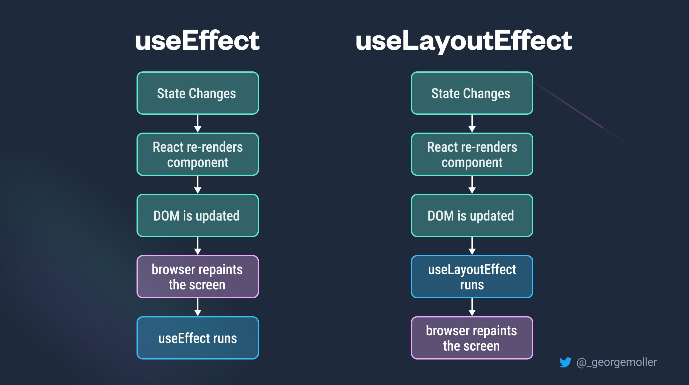

<div style="font-size: 17px;background: black;padding: 2rem;">

`useLayoutEffect` is a hook in React that is quite similar to `useEffect`, but with a critical difference: runs <b style="color: Chartreuse;">synchronously</b> after all DOM mutations. This makes it suitable for tasks that require immediate access to the DOM or need to perform operations before the browser paints the screen.

<br>

See this code:

```js
import React, { useLayoutEffect, useState } from "react";

const TestComponent = () => {
  const [number, setNumber] = useState(1);
  const [isEven, setIsEven] = useState(false);

  // For slowing down rendering
  let now = performance.now(); 
  while (performance.now() - now < 300) {
    // do nothing
  }

  useLayoutEffect(() => {
    if (number % 2 === 0) setIsEven(true);
    else setIsEven(false);
  }, [number]);

  return (
    <>
      <h1>Number = {number}</h1>
      <h1>isEven = {isEven.toString()}</h1>
      <button
        onClick={() => {
          setNumber(number + 1);
        }}
      >
        Increase number
      </button>
    </>
  );
};

export default TestComponent;
```

Here if we will use `useEffect`, first number will increase and then its even/odd status change because hook's code will run after screen has been painted. While if we use `useLayoutEffect`, first hook's code will run and then screen will be painted. See this video with same example - <a href="https://www.youtube.com/shorts/XuoRY_NomnA">Link</a>

<h3 style="border-bottom: 2px solid white; padding-bottom: 2px; display: inline-block;">Use Cases:</h3>

- <span style="color: Cyan;">DOM Measurements and Manipulations:</span> Since it runs after DOM mutations but before painting, useLayoutEffect is suitable for tasks that require measurements or manipulations of the DOM, such as calculating the size or position of elements.
- <span style="color: Cyan;">Synchronizing Layout Effects:</span> When you need to ensure that some code runs synchronously after DOM mutations, useLayoutEffect is a good choice.
- <span style="color: Cyan;">Animation and Transitions:</span> It's often used in animation or transition libraries to ensure that changes are applied synchronously to prevent flickering or janky animations.

<div style="border: 1px solid yellow; padding: 10px;background: red; color: black; font-weight: bold;">

Since `useLayoutEffect` runs synchronously and can potentially block the main thread, it's crucial to ensure that the code inside it is optimized and doesn't cause performance bottlenecks. Avoid performing expensive operations inside `useLayoutEffect`, as it could lead to janky UI or poor user experience. Prefer `useEffect` when possible.
</div>

</div>

<!-- <div style="font-size: 17px;background: black;padding: 2rem;"> -->
<!-- <div style="background: DarkRed;padding: 0.3rem 0.8rem;"> [HIGHLIGHT] -->
<!-- <h3 style="border-bottom: 2px solid white; padding-bottom: 2px; display: inline-block;"> [SUBHEADING] -->
<!-- <b style="color: Chartreuse;"> [NOTE] -->
<!-- <b style="color:red;"> [NOTE-2] -->
<!-- <span style="color: Cyan;"> [IMP] -></span> -->
<!-- <b style="color: Salmon;"> [POINT] -->
<!-- <div style="border: 1px solid yellow; padding: 10px;"> [BORDER] -->
