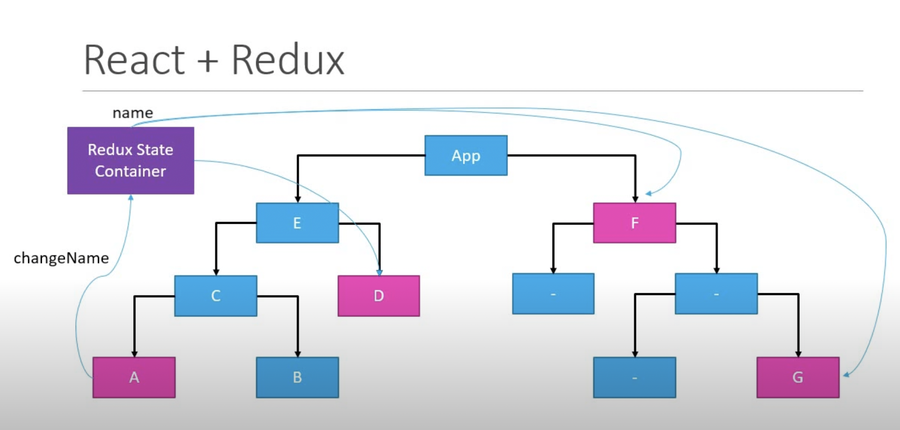
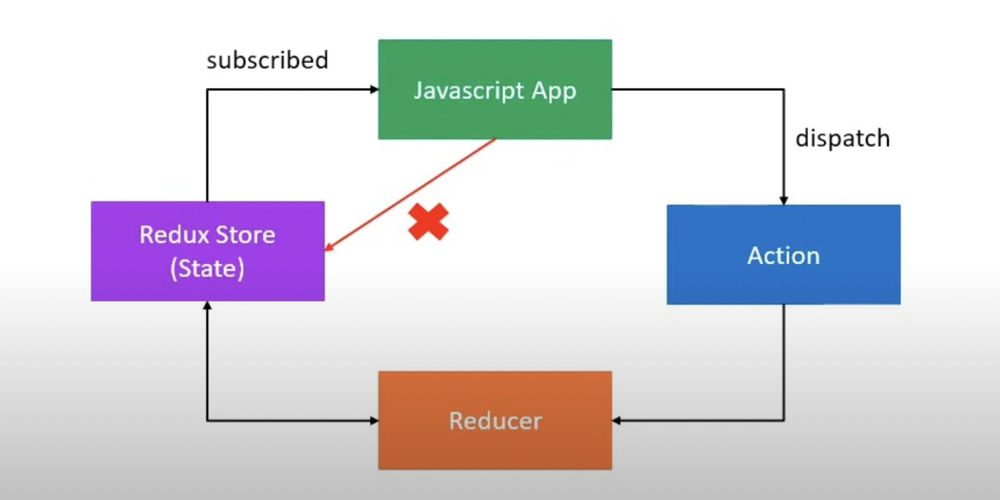
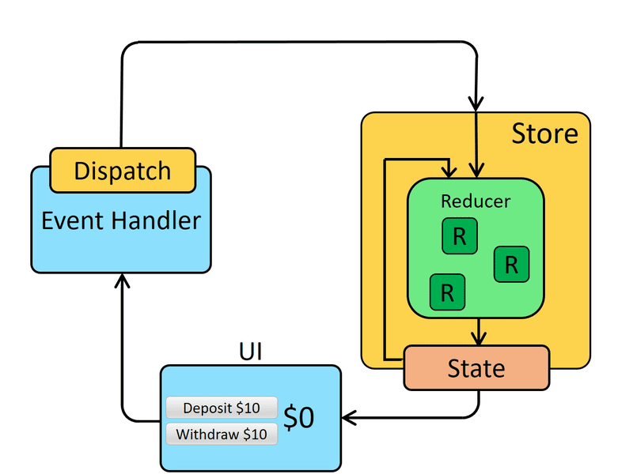

<div style="font-size: 17px;background: black;padding: 2rem;">

**REDUX IS PREDICTABLE STATE CONTAINER FOR JAVASCRIPT APPS.**

Let's break this statement in 3 parts:-

- JAVASCRIPT APPS -> It is not for just React apps. It can be used with Angular, Vue or even Vanilla Javascript. Redux is a library for Javascript applications.
- STATE CONTAINER -> It stores state of your application. It serves as centralized store for state that needs to be used across your entire application. Redux helps you manage "global" state - state that is needed across many parts of your application. Example - `{userName: 'hdubey', password: 'abc', theme: 'Ocean_Waves'}`
- PREDICTABLE - When we say Redux is predictable, it means that the state management and data flow in Redux follow a strict set of rules and patterns, leading to consistent and deterministic behavior. 

Suppose component A has an input field which expects user's name. Now suppose component G needs it too. What we'll have to do it is lift state of component A to App component and pass through all descendants to component G. This makes managing state in application really difficult. Components which do not need the username prop, still have to be aware of it. <br/>

With Redux, your state is contained outside your components. If component A wants to update the state, it communicates with the state container. The state container updates the state in a predictable manner and sends the updated value to only those components that are in need of it. So while dealing with considerable number of components which share some common state, Redux could be used for state management. <br/>



## Principles of Redux
### Predictability of Redux is determined by three most important principles as given below −

1. <b>Single Source of Truth:</b> The state of your whole application is stored in an object tree within a single store. As whole application state is stored in a single tree, it makes debugging easy, and development faster.

2. <b>State is Read-only:</b>
The only way to change the state is to emit an action, an object describing what happened. This means nobody can directly change the state of your application.

3. <b>Changes are made with pure functions:</b>
To specify how the state tree is transformed by actions, you write pure reducers. A reducer is a central place where state modification takes place. Reducer is a function which takes state and action as arguments, and returns a newly updated state. Reducer = (prevState, action) => newState

Above 3 principles in picture: <br/>
All components of Javascript App have access to store. But they all can only read the state, not change it directly. For changing the state, JS app has to dispatch an action to reducer which takes previous state & action and returns new state.


> Internally, React Redux uses React's "context" feature to make the Redux store accessible to deeply nested connected components. More on Redux vs Context - https://stackoverflow.com/questions/49568073/react-context-vs-react-redux-when-should-i-use-each-one 

# All Redux Terminologies in Detail:

## ACTIONS:

An action is a plain JavaScript object that has a `type` field. You can think of an action as an event that describes something that happened in the application. The type field should be a string that gives this action a descriptive name, like "todos/todoAdded". We usually write that type string like "domain/eventName", where the first part is the feature or category that this action belongs to, and the second part is the specific thing that happened. An action object can have other fields with additional information about what happened. By convention, we put that information in a field called payload. A typical action object might look like this:
```js
const addTodoAction = {
  type: 'todos/todoAdded',
  payload: 'Buy milk'
}
```

<span style="color: Chartreuse;">In principle, Redux lets you use any kind of value as an action type. Instead of strings, you could theoretically use numbers, symbols, or anything else (although it's recommended that the value should at least be serializable).</span>


## ACTION CREATORS: 

An action creator is a function that creates and returns an action object. We typically use these so we don't have to write the action object by hand every time:
```js
const addTodo = text => {
  return {
    type: 'todos/todoAdded',
    payload: text
  }
}
```

## REDUCERS: 

A reducer is a function that receives the current state and an action object, decides how to update the state if necessary, and returns the new state: (state, action) => newState. You can think of a reducer as an event listener which handles events based on the received action (event) type. Reducers are the only way to change states in Redux. It is the only place where you can write logic and calculations.
> "Reducer" functions get their name because they're similar to the kind of callback function you pass to the Array.reduce() method.<br/>

Reducers are `pure functions`. 

> A function is called pure if it abides by the following rules − 1) A function returns the same result for same arguments. 2) Its evaluation has no side effects, i.e., it does not alter input data. 3) No mutation of local & global variables. 4) It does not depend on the external state like a global variable.

Reducers must always follow some specific rules:
- They should only calculate the new state value based on the state and action arguments
- They are not allowed to modify the existing state. Instead, they must make immutable updates, by copying the existing state and making changes to the copied values.
- They must not do any asynchronous logic like API calls, calculate random values, or cause other "side effects"

The logic inside reducer functions typically follows the same series of steps:
1. Check to see if the reducer cares about the action received.
2. If it does, make a copy of the state, update the copy with new values, and return it otherwise, return the existing state unchanged.
Here's a small example of a reducer, showing the steps that each reducer should follow:
```js
const initialState = { value: 0 }

function counterReducer(state = initialState, action) {
  // Check to see if the reducer cares about this action
  if (action.type === 'counter/increment') {
    // If so, make a copy of `state`
    return {
      ...state,
      // and update the copy with the new value
      value: state.value + 1
    }
  }
  // otherwise return the existing state unchanged
  return state
}
```

Firstly, if you do not set state to `initialState`, Redux calls reducer with the `undefined` state. This is because <span style="color: yellow">store calls root reducer once(without dispatching action), and saves the return value as its initial state</span>. Also when the first action is dispatched in your application, the reducers will be called to update the state based on the previous state and the action. If an initial previous state is not set, the reducers would receive `undefined` as the previous state. This can lead to unexpected behavior or errors when trying to update the state. 

> Calling store.getState() in a reducer function is an anti-pattern. Reducer functions should be "pure", and only based on their direct inputs (the current state and the action).

## Store: 

The current Redux application state lives in an object called the store. The store is created by passing in a reducer, and has a method called getState that returns the current state value:
```js
import { configureStore } from '@reduxjs/toolkit'
const store = configureStore({ reducer: counterReducer })
console.log(store.getState())
// {value: 0}
```

## Dispatch: 

The Redux store has a method called `dispatch`. The only way to update the state is to call `store.dispatch()` and pass in an action object. The store will run its reducer function and save the new state value inside, and we can call getState() to retrieve the updated value:

```js
store.dispatch({ type: 'counter/increment' })
console.log(store.getState())
// {value: 1}
```

## Selectors: 

Selectors are functions that know how to extract specific pieces of information from a store state value. As an application grows bigger, this can help avoid repeating logic as different parts of the app need to read the same data:

```js
const selectCounterValue = state => state.value
const currentValue = selectCounterValue(store.getState())
console.log(currentValue)
// 2
```

# REDUX APPLICATION DATA FLOW: 

## Initial setup:

- A Redux store is created using a root reducer function
- The store calls the root reducer once, and saves the return value as its initial state
- When the UI is first rendered, UI components access the current state of the Redux store, and use that data to decide what to render. They also subscribe to any future store updates so they can know if the state has changed.

## Updates:
- Something happens in the app, such as a user clicking a button
- The app code dispatches an action to the Redux store, like `dispatch({type: 'counter/increment'})`
- The store runs the reducer function again with the previous state and the current action, and saves the return value as the new state
- The store notifies all parts of the UI that are subscribed that the store has been updated
- Each UI component that needs data from the store checks to see if the parts of the state they need have changed.
- <span style="color: yellow">Each component that sees its data has changed forces a re-render with the new data, so it can update what's shown on the screen</span>.

<br/><br/>

# Multiple Reducers:
For large scale applications, if we try to handle every action in one reducer function, it's going to be hard to read it all as it will become a huge function. Using multiple reducers instead of a single one helps with code organization, separation of concerns, scalability, reusability, independent state updates, simplified testing, and customization through middleware and enhancers. It provides a structured and modular approach to managing complex state in Redux applications. For demo, let's write 2 reducers for managing cakes and ice-creams in a shop: 
```js
const initialCakeState = { numOfCakes: 10 };
const initialIceCreamState = { numOfIceCreams: 20 };

const cakeReducer = (state = initialCakeState, action) => {
    switch(action.type) {                                  
        case BUY_CAKE: return {
            ...state,
            numOfCakes: state.numOfCakes - 1,
        }
        default: return state;
    }
};

const iceCreamReducer = (state = initialIceCreamState, action) => {
    switch(action.type) {                        
        case BUY_ICECREAM: return {
            ...state,
            numOfIceCreams: state.numOfIceCreams - 1,
        }
        default: return state;
    }
}
```
A Redux app really only has one reducer function: the "root reducer" function that you will pass to createStore later on. That one root reducer function is responsible for handling all of the actions that are dispatched, and calculating what the entire new state result should be every time. <br/>
## Combining Reducers
Since reducers are normal JS functions, we can write a new root reducer whose only job is to call the other two functions. <span style="color: #ADFF2F">First time this state.cakes being passed is undefined which is why cakeReducer has default argument</span>.
```js
function rootReducer(state = {}, action) {
  // always return a new object for the root state
  return {
    // the value of `state.cakes` is whatever the cakeReducer reducer returns
    cakes: cakeReducer(state.cakes, action), 
    // For both reducers, we only pass in their slice of the state
    iceCreams: iceCreamReducer(state.iceCreams, action)
  }
}
```
<span style="color:#7FFFD4">Note that each of these reducers is managing its own part of the global state. The state parameter is different for every reducer, and corresponds to the part of the state it manages. This allows us to split up our logic based on features and slices of state, to keep things maintainable.</span>

`combineReducers`:- <br/>
We can see that the new root reducer is doing the same thing for each slice: calling the slice reducer, passing in the slice of the state owned by that reducer, and assigning the result back to the root state object. If we were to add more slices, the pattern would repeat.

The Redux core library includes a utility called combineReducers, which does this same boilerplate step for us. We can replace our hand-written rootReducer with a shorter one generated by combineReducers.

```js
const rootReducer = combineReducers({
    cake: cakeReducer,
    iceCream: iceCreamReducer,
});
const store = createStore(rootReducer); 
```

> combineReducers accepts an object where the key names will become the keys in your root state object, and the values are the slice reducer functions that know how to update those slices of the Redux state. Remember, the key names you give to combineReducers decides what the key names of your state object will be!

# Immer

"Mutable" means "changeable". If something is "immutable", it can never be changed. JavaScript objects and arrays are all mutable by default. If I create an object, I can change the contents of its fields. If I create an array, I can change the contents as well:
```js
const obj = { a: 1, b: 2 }; 
obj.b = 3; // still the same object outside, but the contents have changed

const arr = ['a', 'b'];
// In the same way, we can change the contents of this array
arr.push('c')
arr[1] = 'd'
```

This is called mutating the object or array. It's the same object or array reference in memory, but now the contents inside the object have changed.

<span style="color: Chartreuse;">In order to update values immutably, your code must make copies of existing objects/arrays, and then modify the copies.</span>

We can do this by hand using JavaScript's array / object spread operators, as well as array methods that return new copies of the array instead of mutating the original array.

One of the primary rules of Redux is that - <i>our reducers are never allowed to mutate the original / current state values!</i>

There are several reasons why you must not mutate state in Redux:
- It causes bugs, such as the UI not updating properly to show the latest values
- It makes it harder to understand why and how the state has been updated
- It makes it harder to write tests
- It breaks the ability to use "time-travel debugging" correctly
- It goes against the intended spirit and usage patterns for Redux

In case of heave nested states, updating the state by hand using spread operator becomes really hard. A typical example might look like this: 
```js
function handwrittenReducer(state, action) {
  return {
    ...state,
    first: {
      ...state.first,
      second: {
        ...state.first.second,
        [action.someId]: {
          ...state.first.second[action.someId],
          fourth: action.someValue,
        },
      },
    },
  }
}
```

HERE COMES THE LIBRARY <i style="color: OrangeRed;">immer</i> TO HELP US OUT BY SIMPLIFYING THE PROCESS OF WRITING IMMUTABLE UPDATE LOGIC!! 

Immer provides a function called `produce`, which accepts two arguments: (1) Your original state, and (2) A callback function. The callback function is given a "draft" version of that state, and inside the callback, it is safe to write code that mutates the draft value. Immer tracks all attempts to mutate the draft value and then replays those mutations using their immutable equivalents to create a safe, immutably updated result:

```js
import produce from 'immer'

const baseState = [
  { todo: 'Learn typescript', done: true },
  { todo: 'Try immer', done: false },
]

const nextState = produce(baseState, (draft) => {
  draft.push({ todo: 'Tweet about it' });   // "mutate" the draft array
  draft[1].done = true;   // "mutate" the nested state
});

console.log(baseState === nextState) // false - the array was copied
console.log(baseState[0] === nextState[0]) // true - the first item was unchanged, so same reference
console.log(baseState[1] === nextState[1]) // false - the second item was copied and updated
```

We can simplify writing reducers by using the `curried form of produce`, where we pass produce only the recipe function(callback function), and produce will return a new function that will apply recipe to the base state.
```js
//curried produce signature
produce(callback) => (state) => nextState
```

The curried produce function accepts a function as its first argument and returns a curried produce that only now requires a state from which to produce the next state. The first argument of the function is the draft state (which will be derived from the state to be passed when calling this curried produce). Then follows every number of arguments we wish to pass to the function.

All we need to do now to use this function is to pass in the state from which we want to produce the next state and the action object like so.

```js
const enhancedReducer = produce((draft, action) => {...});
```


# Middleware
Redux middleware function provides a medium to interact with dispatched action before they reach the reducer. It provides a third-party extension point between dispatching an action, and the moment it reaches the reducer. People use Redux middleware for logging, crash reporting, talking to an asynchronous API, routing, and more. Redux middleware are actually implemented on top of a very special store enhancer that comes built in with Redux, called `applyMiddleware`. <br>

<span style="color: pink">applyMiddleware is an API provided by Redux which allows us to use custom middleware as well as Redux middlewares like redux-thunk, redux-logger & redux-promise.</span> It applies middlewares to store. The syntax of using applyMiddleware API is − `applyMiddleware(...middleware)`

# Thunk Middleware

The word "thunk" is a programming term that means "a piece of code that does some delayed work". Rather than execute some logic now, we can write a function body or code that can be used to perform the work later. For Redux specifically, "thunks" are a pattern of writing functions with logic inside that can interact with a Redux store's dispatch and getState methods. Using thunks requires the redux-thunk middleware to be added to the Redux store as part of its configuration. <span style="color: HotPink">Thunks are a standard approach for writing async logic in Redux apps, and are commonly used for data fetching</span>. However, they can be used for a variety of tasks, and can contain both synchronous and asynchronous logic. <span style="color:OrangeRed">Redux Thunk is middleware that allows you to return functions, rather than just actions, within Redux.  The returned function receives the dispatch method from the store and then later it is used to dispatch synchronously inside the body of function once the asynchronous actions have been completed. This allows for delayed actions, including working with promises.</span>

```js
const GET_CURRENT_USER = 'GET_CURRENT_USER';
const GET_CURRENT_USER_SUCCESS = 'GET_CURRENT_USER_SUCCESS';
const GET_CURRENT_USER_FAILURE = 'GET_CURRENT_USER_FAILURE';

const getUser = () => {
  return (dispatch) => {     //nameless functions
    // Initial action dispatched
    dispatch({ type: GET_CURRENT_USER });
    // Return promise with success and failure actions
    return axios.get('/api/auth/user').then(  
      user => dispatch({ type: GET_CURRENT_USER_SUCCESS, user }),
      err => dispatch({ type: GET_CURRENT_USER_FAILURE, err })
    );
  };
};

store.dispatch(getUser());
```

# redux-actions Library

There are many functions in this library but we are gonna study only 2 of them in brief - `createAction` & `handleActions`. All details about this library here - https://redux-actions.js.org/api 

<div style="font-size: 25px; text-decoration: underline; font-weight: bold">createAction</div>

The usual way to define an action in Redux is to separately declare an action type constant and an action creator function for constructing actions of that type.

```js
const INCREMENT = 'counter/increment';
const increment = amount =>  ({ type: INCREMENT, payload: amount });
const action = increment(3); // { type: 'counter/increment', payload: 3 }
```

The `createAction` helper combines these two declarations into one. It takes an action type and returns an action creator for that type. The action creator can be called either without arguments or with a payload to be attached to the action.

```js
import { createAction } from 'redux-actions';
const increment = createAction('counter/increment')
let action = increment(); // returns -> { type: 'counter/increment' }
action = increment(3); // returns -> { type: 'counter/increment', payload: 3 }
```

By default, the generated action creators accept a single argument, which becomes `action.payload`. This requires the caller to construct the entire payload correctly and pass it in.

In many cases, you may want to write additional logic to customize the creation of the payload value, such as accepting multiple parameters for the action creator, generating a random ID, or getting the current timestamp. To do this, createAction accepts an optional second argument: a "`prepare` callback" that will be used to construct the payload value.

```js
import { createAction } from 'redux-actions';

const addTodo = createAction('todos/add', function prepare(text) {
  return {
    payload: {
      text,
      id: `HD@123`,
      createdAt: new Date().toISOString(),
    },
  }
});

console.log(addTodo('Write more docs'))
/**
 * {
 *   type: 'todos/add',
 *   payload: {
 *     text: 'Write more docs',
 *     id: 'HD@123',
 *     createdAt: '2019-10-03T07:53:36.581Z'
 *   }
 * }
 **/
```

If provided, all arguments from the action creator will be passed to the prepare callback, and it should return an object with the payload field (otherwise the payload of created actions will be undefined). Additionally, the object can have a meta and/or an error field that will also be added to created actions. meta may contain extra information about the action, error may contain details about the action failure. These three fields (payload, meta and error) adhere to the specification of Flux Standard Actions.

Note: The type field will be added automatically.

> More details on `createAction` here -> https://redux-toolkit.js.org/api/createAction 

<div style="font-size: 25px; text-decoration: underline; font-weight: bold">handleActions</div><br>

```js
handleActions(reducerMap, defaultState);
```

Creates multiple reducers and combines them into a single reducer that handles multiple actions. Accepts a map where the keys are `action type`, and the values are passed as the second parameter `either a reducer or reducer map`. The map must not be empty.

```js
const reducer = handleActions(
  {
    INCREMENT: (state, action) => ({
      counter: state.counter + action.payload
    }),

    DECREMENT: (state, action) => ({
      counter: state.counter - action.payload
    })
  },
  { counter: 0 }
);
```

<br>

# reselect 

`reselect` is a library commonly used with Redux to efficiently compute derived data from the Redux store. It helps in optimizing the performance of your application by preventing unnecessary recalculations of computed values. One of the key concepts in reselect is the `createSelector` function.

<h3 style="text-decoration: underline;">createSelector</h3>

<i><b style="color: Chartreuse;">createSelector(...inputSelectors | [inputSelectors], resultFunc, selectorOptions?)</b></i>

Reselect exports a `createSelector` API, which generates memoized selector functions. It accepts one or more "input" selectors, which extract values from arguments, and an "output" selector that receives the extracted values and should return a derived value. If the generated selector is called multiple times, the output will only be recalculated when the extracted values have changed.

Exact arguments -> (1) one or more "input selectors" (either as separate arguments or a single array), (2) a single "output selector" / "result function", and (3) an optional options object, and generates a memoized selector function.

When the selector is called, each input selector will be called with all of the provided arguments. The extracted values are then passed as separate arguments to the output selector, which should calculate and return a final result. The inputs and result are cached for later use.

If the selector is called again with the same arguments, the previously cached result is returned instead of recalculating a new result.

createSelector determines if the value returned by an input-selector has changed between calls using reference equality (===). Inputs to selectors created with createSelector should be immutable.

```js
import { createSelector } from 'reselect';

const getUsers = state => state.users;
const getFilter = state => state.filter;

const getFilteredUsers = createSelector(
  [getUsers, getFilter], // They can also be separate arguments instead of array
  (users, filter) => {
    return users.filter(user => user.name.includes(filter));
  }
);
```

```js
...
const mapStateToProps = state => {
  return {
    filteredUsers: getFilteredUsers(state),
  };
};
...
```

The key benefit of createSelector is that it helps you avoid unnecessary recalculations of derived data in your Redux application, leading to improved performance. It's especially useful when working with complex data transformations or when rendering components that rely on computed values.


</div>

<!-- <div style="background: DarkRed;  padding: 0.3rem 0.8rem;"> => HIGHLIGHT -->
<!-- <h3 style="text-decoration: underline;"> => SUBHEADING -->
<!-- <span style="color: Chartreuse;"> => IMPORTANT-1 -->
<!-- <i> => IMPORTANT-2 -->
<!-- <mark style="padding: 0.3rem 0.8rem;"> => IMPORTANT-3 -->
<!-- <b> => IMPORTANT-5 -->
<!-- <b style="color:red;"> => NOTE -->
<!-- <br><span style="color: Cyan;">-></span> -->