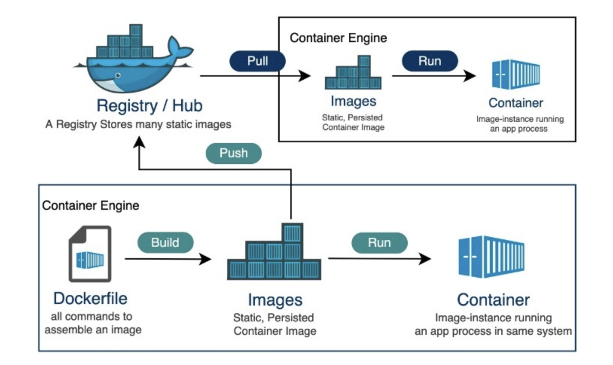

<div style="font-size: 17px;background: black;padding: 2rem;">

Docker is a software platform that allows you to build, test, and deploy applications quickly. Docker packages software into standardized units called <b style="color:Violet;">containers</b> that have everything the software needs to run including libraries, system tools, code, and runtime. Using Docker, you can quickly deploy and scale applications into any environment and know your code will run.

Consider a shipping container; it can easily be moved between different sites and accommodates all of your belongings, including clothing and furnishings. In the same manner, Docker containers, independent of the underlying operating system, encompass all the requirements of an application. This guarantees consistency in behavior and gets rid of compatibility problems that sometimes arise with traditional deployments.

Technically, Docker does this by using the virtualization capabilities of the operating system's kernel. Containers are lightweight and extremely portable since they share the host's operating system kernel, unlike virtual machines that mimic full hardware systems. Developers may create, manage, and launch these containers in a variety of environments, from local development workstations to cloud-based production servers, with the help of Docker's suite of tools and APIs.

Docker works by providing a standard way to run your code. Docker is an operating system for containers. Similar to how a virtual machine virtualizes (removes the need to directly manage) server hardware, containers virtualize the operating system of a server. Docker is installed on each server and provides simple commands you can use to build, start, or stop containers.

<h3 style="border-bottom: 2px solid white; padding-bottom: 2px; display: inline-block;">Traditional Deployment vs Docker Deployment</h3>

Let's look at a web application that was created using a particular Python version and a few third-party libraries. The required Python version, libraries, and environment configuration would need to be manually installed to deploy this application on a new server. It is necessary to repeat this procedure on each server, which can be laborious and prone to errors.

This is where Docker excels. Developers can use Docker to generate a container image that contains the application code together with all of its dependencies (particular libraries and versions of Python) and any setups that the system may require. After that, this image may be quickly installed on any host that has Docker installed.

By providing the container with an isolated environment, the Docker engine prevents problems with other programs or libraries on the host system. This saves developers a great deal of time and work because it not only makes deployment simpler but also ensures consistent behavior across all settings.

<h3 style="border-bottom: 2px solid white; padding-bottom: 2px; display: inline-block;">Key Concepts</h3>

<b style="color:DarkSalmon;">Containers:</b> They are lightweight, isolated environments that allow applications to run consistently across different environments. Containers package the application code, along with its dependencies, libraries, and configuration files, in a way that makes them portable across different systems. 

- Unlike Virtual Machines (VMs), containers share the host OS kernel, making them much smaller and faster to start and stop. This results in less overhead compared to VMs.
- Containers isolate the processes running inside them from other processes running on the host system. This isolation is achieved using technologies like Linux namespaces and cgroups.

<b style="color:DarkSalmon;">Docker Images:</b> A Docker image is a read-only, immutable template that contains the application code, its runtime, libraries, environment variables, and any necessary configuration files. It is the blueprint used to create Docker containers. Images are typically built using <span style="color:Yellow;">Dockerfile</span>, which describes the environment and setup instructions.

- Docker images are built in layers. Each command in a Dockerfile (e.g., `RUN`, `COPY`, `ADD`) adds a new layer on top of the previous one. These layers make images more efficient, as Docker caches layers and reuses them when building new images.
- Images can be shared via Docker registries (like Docker Hub) and run on any host that supports Docker.
- Each image can be tagged with a version, making it easy to roll back to previous versions if needed.

Docker images are read-only templates, so any changes you make to the running program happen inside a container, not to the image itself. By doing this, a clear division is maintained between the runtime state (container) and the application definition (image). In addition, since new versions may be made with targeted modifications without affecting already-existing containers, image versioning and maintenance are made simpler.

<b style="color:DarkSalmon;">Dockerfile:</b> A Dockerfile is a script that contains a series of instructions to assemble a Docker image. It defines the steps needed to set up the application, such as installing dependencies, copying files, configuring environment variables, and setting the entry point for the container. It's a simple way to automate the image creation process.

Key Instructions:

- <span style="color: Chartreuse;">FROM</span>: This instruction sets the base image on which the new image is going to be built upon. This base image could be a minimal operating system (like Ubuntu or Alpine), a language runtime environment (like Node.js, Python), or even a custom pre-built image. It is usually the first instruction in a Dockerfile. Syntax: <span style="color: HotPink;">FROM `image`:`tag`</span>.

    - `image`: The name of the base image. It could be an image from a public Docker registry (like Docker Hub), a private registry, or a local image.
    - `tag`:  (Optional) The tag indicates the version or variant of the image to be used. If no tag is specified, Docker defaults to the `latest` tag.

    Example: `FROM node:14`. It can also reference images stored in a private Docker registry rather than the public Docker Hub. Example: `FROM myprivateregistry.com/mycompany/myapp:latest`

- <span style="color: Chartreuse;">RUN</span>: Executes a command inside the container during image building, such as installing software packages. Example: `RUN yarn install`.
- <span style="color: Chartreuse;">COPY</span>: Like COPY but more advanced in features like it auto-decompresses archives and fetches files from URLs. Example - `COPY . /app`: Here, Dot(<span style="color: Cyan;">.</span>) refers to the current directory where the Docker build is executed and <span style="color: Cyan;">/app</span> is the target directory inside the container where the files from the current directory on your local machine will be copied. If /app does not already exist inside the container, Docker will create it automatically.
- <span style="color: Chartreuse;">ADD</span>: Copies files and directories from the host system to the container. Example: `ADD https://example.com/file.tar.gz /app`.
- <span style="color: Chartreuse;">CMD</span>: Specifies the command to run when a container starts. There can only be one CMD instruction in a Dockerfile. If you list more than one CMD, then only the last CMD will take effect. Example: `CMD ["python3", "main.py"]`. 
- <span style="color: Chartreuse;">EXPOSE</span>: This option defines to Docker that the container listens on the declared network ports at runtime. Example: `EXPOSE 8000`.
- <span style="color: Chartreuse;">WORKDIR</span>: Sets the working directory where the subsequent commands in a Dockerfile will be executed. Example: `WORKDIR /app`.
- <span style="color: Chartreuse;">ENV</span>: Defines environment variables within the container. Example: `ENV FLASK_APP=main.py`
- <span style="color: Chartreuse;">ARG</span>: This command defines a variable that allows users to be passed to the builder at build time using the "--build-arg" flag on the docker build command. Example - `ARG version=1 `.

<b style="color:DarkSalmon;">Docker Hub:</b> Docker Hub is a cloud-based registry that allows developers to store, share, and manage Docker images. It serves as a centralized repository for Docker images, making it easy for teams to distribute and reuse images across different environments. 

- **Public and Private Repositories:** Docker Hub allows users to create both public (free) and private (paid) repositories for storing Docker images.
- **Official Images:** Docker Hub hosts a large number of official images maintained by Docker or third-party organizations. These include images for programming languages, databases, web servers, and more (e.g., node, nginx, mysql). With a single command, users can find images based on particular criteria, like functionality, operating system version, or search terms, and then pull those images into their local environment.
- **Image Tags:** Images can have multiple tags (e.g., node:14, node:latest), representing different versions or configurations of the same image.
- **Automation Tools:** It offers tools for automating the build, test, and deployment of Docker images. This includes functions like integration with CI/CD pipelines for smooth continuous integration and delivery workflows. Moreover, it provides support for automated builds, which start builds automatically whenever changes are pushed to a repository.

<br>


<h3 style="border-bottom: 2px solid white; padding-bottom: 2px; display: inline-block;">.env file</h3>

A `.env` file is used in software projects to store environment variables. These variables often include sensitive data or configuration settings that you don't want to hard-code into your application, such as API Endpoints, Feature flags, Build Configuration(Configure behavior for different environments - development, staging, production). Example:

```
REACT_APP_API_URL=https://api.example.com
REACT_APP_GOOGLE_MAPS_KEY=your-public-google-maps-key
REACT_APP_FEATURE_FLAG=true
```

In the application, you can access these variables like:

- Node.js: `process.env.API_KEY`
- Python: `os.getenv('API_KEY')`

</div>