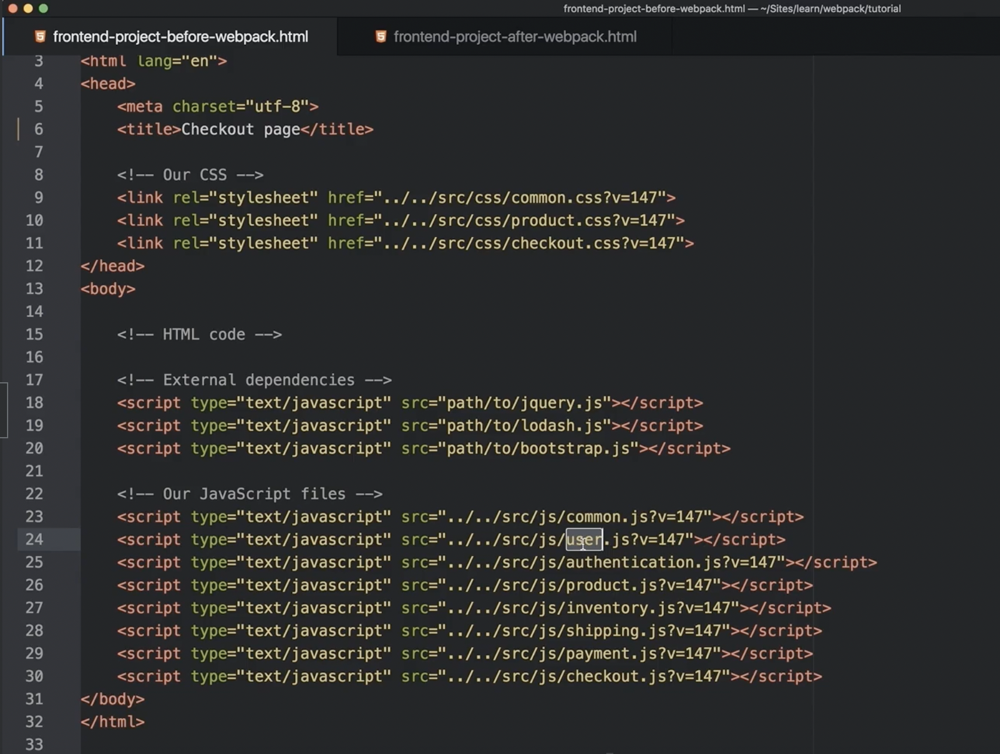

<div style="font-size: 17px;background: black;padding: 2rem;">

In the very beginning of web development world, html files of big projects used to like the given below file. Import order was necessary because some scripts depended on others. A couple of files could be managed like this but what if there are 100s of files dependent on each other? One minor error in ordering and entire system would collapse. Then came the entry of <span style="color: Orange;">webpack</span>!

<br>

As its core, webpack is a <b style="color:DarkKhaki;"><u>static module bundler</u></b>. In a particular project, webpack treats all files and assets as modules. Under the hood, it relies on a <b style="color:Magenta;"><u>dependency graph</u></b>. A dependency graph describes how modules relate to each other using the references (require and import statements) between files. In this way, webpack statically traverses all modules to build the graph, and uses it to generate a single bundle (or several bundles) — a JavaScript file containing the code from all modules combined in the correct order. “Statically” means that, when webpack builds its dependency graph, it doesn’t execute the source code but stitches modules and their dependencies together into a bundle. This can then be included in your HTML files.

Let's break down some important terminologies used above for better understanding:

- **BUNDLER**: When you're building a website, you often have many separate files containing JavaScript, CSS, images, and other assets. A bundler takes all these separate files and combines them into fewer files, or "bundles". This can improve performance by reducing the number of HTTP requests a browser needs to make to render your web page.
- **DEPENDENCY GRAPH**: Any time one file depends on another, webpack treats this as a <u><i>dependency</i></u>. This allows webpack to take non-code assets, such as images or web fonts, and also provide them as dependencies for your application. When webpack processes your application, it starts from a list of modules defined on the command line or in its configuration file. Starting from these `entry points`, webpack recursively builds a <u><i>dependency</i></u> graph that includes every module your application needs, then bundles all of those modules into a small number of bundles - often, only one - to be loaded by the browser.

<h3 style="border-bottom: 2px solid white; padding-bottom: 2px; display: inline-block;">Webpack Installation</h3>

Other than `webpack`, we need to install one more package called `webpack-cli` to use Webpack from the command line (we'll be prompted to install it if we don't). Depending on project's needs, we'll likely need additional loaders and plugins.

```
npm install webpack webpack-cli --save-dev
```

<span style="color:Orange;">EACH AND EVERYTHING THAT WE ARE GOING TO INSTALL RELATED TO WEBPACK SHOULD BE INSTALLED AS DEV-DEPENDENCY. BECAUSE THEY ARE ONLY GOING TO HELP IN BUILDING THE APPLICATION, NOT IN RUNNING IT ON PRODUCTION.</span>

<h3 style="border-bottom: 2px solid white; padding-bottom: 2px; display: inline-block;">Webpack Configuration</h3>

Webpack stores it's configuration in a JavaScript file (typically named `webpack.config.js`) that instructs Webpack on how to process your project's code and assets. It provides essential details about your project's structure, dependencies, and desired output. If we don't create it, webpack uses it's default one. This file is basically a JavaScript module. Webpack expects this module to export the configuration object. Remember that we having to use old way of importing and exporting in this file (common js) and not ES6 modules. It was always like this and it's still the case in Webpack 5.

<h3 style="border-bottom: 2px solid white; padding-bottom: 2px; display: inline-block;">Running webpack</h3>

Executing the command `webpack` directly won't work unless we install webpack globally. Hence, we use `npx`. If a configuration file is created, webpack command followed by `--config` option and the path to configuration file is used.

```bash
npx webpack --config webpack.custom.js
```

To make it more convenient, we can add a script to `package.json` file to run webpack with our custom configuration.

```json
{
  "scripts": {
    "build": "webpack --config webpack.custom.js"
  }
}
```

If we run the webpack command without specifying a `--config` option, webpack looks for a default configuration file named `webpack.config.js` in the root directory of your project. If this file exists, webpack will automatically use it without the need for the `--config` command like this:

```bash
npx webpack
```

If there is no webpack configuration file, webpack will create bundles with default configuration.

<br>

# Webpack Main Concepts

Webpack has some main concepts which we need to understand clearly before digging in its practical implementation. Let’s examine them one by one:

## ENTRY

An entry point indicates which module webpack should use to begin building out its internal dependency graph. Webpack will figure out which other modules and libraries that entry point depends on (directly and indirectly). By default its value is .`/src/index.js`, but you can specify a different (or multiple) entry points by setting an <span style="color: Cyan;">entry</span> property in the webpack configuration.

```js
// webpack.config.js
module.exports = {
  entry: './path/to/my/entry/file.js',
};
```

The single entry syntax for the `entry` property is a shorthand for:

```js
// webpack.config.js
module.exports = {
  entry: {
    main: './path/to/my/entry/file.js',
  },
};
```

We can also pass an array of file paths to the entry property which creates what is known as a **<u>"multi-main entry"</u>**. This is useful when you would like to inject multiple dependent files together and graph their dependencies into one "chunk".

```js
// webpack.config.js
module.exports = {
  entry: ['./src/file_1.js', './src/file_2.js'],
  output: {
    filename: 'bundle.js',
  },
};
```

Although using multiple entry points per page is allowed in webpack, it should be avoided when possible in favor of an entry point with multiple imports: `entry: { page: ['./analytics', './app'] }`. This results in a better optimization and consistent execution order when using async script tags.

Single Entry Syntax is a great choice when you are looking to quickly set up a webpack configuration for an application or tool with one entry point (i.e. a library). However, there is not much flexibility in extending or scaling your configuration with this syntax.

<b style="color:red;">Multi-Page Application:</b>

```js
// webpack.config.js
module.exports = {
  entry: {
    pageOne: './src/pageOne/index.js',
    pageTwo: './src/pageTwo/index.js',
    pageThree: './src/pageThree/index.js',
  },
};
```

Here, we are telling webpack that we would like 3 separate dependency graphs (like the above example). This is useful for splitting your application into separate bundles, for example, a main application bundle and a vendor bundle for third-party libraries. Each key-value pair in the object represents a different entry point and each key represents a bundle name and the value is an array/string containing file path(s) to the JavaScript files that act as entry points for that bundle. The main purpose of this is to optimize load times and performance.

<div style="border: 3px solid SkyBlue; padding: 10px;">Check this out: <a href="https://webpack.js.org/guides/entry-advanced/">ADVANCED ENTRY OPTION CONFIGURATION</a></div><br>


## OUTPUT

This property tells Webpack how to name the output files and where to save them. It defaults to `./dist/main.js` for the main output file and to the `./dist` folder for any other generated file. This part of the process can be configured by specifying an <span style="color: Cyan;">output</span> field in your configuration:

```js
// webpack.config.js;
const path = require('path');

module.exports = {
  entry: './path/to/my/entry/file.js',
  output: {
    path: path.resolve(__dirname, 'dist'), // MUST USE ABSOLUTE PATH! NOT THE RELATIVE ONE!
    filename: 'my-first-webpack.bundle.js',
  },
};
```

In the example above, we use the <span style="color: Cyan;">output.filename</span> and the <span style="color: Cyan;">output.path</span> properties to tell webpack the name of our bundle and where we want it to be emitted to. Setting `fileName` is minimum requirement for using `output` property. `filename` can also include directory to separate out js bundles from other bundles like css. Example - `js/[name].[hash].js`

The `path` module used is a built-in `Node.js` module that provides utilities for working with file and directory paths. `__dirname` is a `Node.js` global variable that represents the directory name of the current module (i.e., the directory in which the current JavaScript file resides). The `path.resolve` method resolves a sequence of paths or path segments into an absolute path. It computes the absolute path by processing each given sequence from right to left, prepending each segment until an absolute path is constructed.

If the configuration creates more than a single "chunk" (as with multiple entry points or when using plugins like `CommonsChunkPlugin`), one should use `substitutions` to ensure that each file has a unique name. These substitutions are replaced with dynamic values during the bundling process, resulting in more informative and flexible file names for your output bundles. Here are some common substitutions you can use:

- `[name]`: Entry point name
- `[id]`: Chunk ID
- `[hash]`: Compilation hash
- `[chunkhash]`: Chunk-specific hash
- `[contenthash]`: The hash of the chunk, including only elements of this content type.

```js
// webpack.config.js;
module.exports = {
  entry: {
    app: './src/app.js',
    search: './src/search.js',
  },
  output: {
    filename: '[name].js',
    path: __dirname + '/dist',
  },
};

// writes to disk: ./dist/app.js, ./dist/search.js
```

Some other configurable features in `output` property:

- <span style="color: Cyan;">publicPath</span> (🚨 <u>**confusing topic!!**</u> 🚨<a href="https://www.youtube.com/watch?v=oSOPsRbBiIU"> Video Explanation</a>): This property is used to specify the base path for all assets within your application. It determines the location where the bundled files will be available in the browser. This is particularly important for <u>dynamically loaded assets</u> like images, stylesheets, and JavaScript files. 

  It tells Webpack and the browser where to find these assets. When the application dynamically loads chunks or assets, Webpack uses the `publicPath` to construct the URL from which these assets are served. This is essential for applications that use code splitting or lazy loading.

  Essentially, every file emitted to `output.path` directory will be referenced from the `output.publicPath` location. This includes child chunks (created via code splitting) and any other assets (e.g. images, fonts, etc.) that are a part of dependency graph.

  If we want to serve assets from a Content Delivery Network (CDN) or a different server, we can set the `publicPath` to the URL of the CDN. Webpack automatically replaces references to assets with URLs based on the `publicPath`. This ensures that all asset requests are directed to the CDN rather than your main server.

  Absolute paths are commonly used for CDNs or when the assets are served from a different domain or server while relative paths are useful when assets are served from the same domain but a different sub-directory.

  - <span style="color: Gold;">Root Directory ("/")</span>: This configuration implies that the assets are served from the root of the server.
  - <span style="color: Gold;">Sub-Directory ("/assets/")</span>: This configuration implies that the assets are served from a sub-directory `'/assets/'`.
  - <span style="color: Gold;">CDN url</span>: This configuration implies that the assets are served from a CDN.

- <span style="color: Cyan;">clean</span>:`(boolean | object)` Clean the output directory before emit if passed `true`.

<br>

## MODES

By setting the <span style="color: Cyan;">mode</span> parameter to either <span style="color: Yellow;">development</span>, <span style="color: Yellow;">production</span> or <span style="color: Yellow;">none</span>, you can enable webpack's built-in optimizations that correspond to each environment. The default value is `production`.

<b style="color:LawnGreen;">Development</b> mode is used while actively developing and debugging application. It provides detailed error messages, faster rebuilds, and enhanced debugging capabilities. Bundle size is not the concern here as it is served from localhost only. <b style="color:OrangeRed;">Production</b> mode is used when application is ready to be deployed. It optimizes for performance and bundle size, ensuring a fast and efficient end-user experience. <b style="color:DarkKhaki;">None</b> mode is used when full control over the webpack configuration without any defaults is needed. It is useful for advanced use cases where you want to experiment or fine-tune every aspect of the build process.

```js
// webpack.config.js
module.exports = {
  mode: 'development', // Can take 'development', 'production' and 'none' as its value
  entry: './src/index.js',
  output: {
    filename: 'bundle.js',
    path: path.resolve(__dirname, 'dist'),
  },
};
```

- <u>**Development mode:**</u>

  - Optimizes the build for faster rebuilds and better debugging during development.
  - Enables useful error messages.
  - Sets <b style="color:Violet;">process.env.NODE_ENV</b> on `DefinePlugin` to value `"development"`.
  - Modules and chunks are named for better debugging. This helps to identify which files are being processed.
  - JavaScript is not minified, which makes it easier to read and debug.
  - Built-in `devtool: 'eval'` is used which generates high-quality, fast source maps that are suitable for development but not for production.

- <u>**Production mode:**</u>

  - Focuses on delivering the smallest possible bundle size and optimizing for speed.
  - Optimizes the build for deployment to a production environment.
  - Enables aggressive optimizations like minification, tree-shaking, and scope hoisting.
  - Sets `process.env.NODE_ENV` on `DefinePlugin` to value `"production"`.
  - Uses built-in production optimizations such as enabling `TerserPlugin` for minifying JavaScript.
  - Generates optimized, smaller bundles for better performance.
  - `devtool: 'source-map'`is set that generates source maps that are more suitable for production, helping to debug without revealing full source code.

- <u>**None mode:**</u>
  - Disables all built-in optimizations. This is a bare-bones configuration where you explicitly define all optimizations.
  - No optimizations are applied.
  - Useful for highly customized builds where default optimizations are not desired.

<br>

## TARGET

The <span style="color: Cyan;">target <i>`(object)`</i></span> configuration option in Webpack specifies the environment in which the output bundle will run. This influences how Webpack processes and bundles the code, including the built-in libraries it provides and the way it handles certain features. Depending on the target, Webpack adjusts the output to be compatible with the specific environment, such as a web browser, Node.js, or an Electron application. 

Available values for this option:

- <span style="color: Gold;">web</span>: The default target. Optimizes the bundle for web browsers. Use this for applications that run in a web browser.
- <span style="color: Gold;">node</span>: Optimizes the bundle for `Node.js` environments. Uses `Node.js` require to load chunks. 

Similarly there are many more targets! And custom ones can also be created! Can be explored but not needed much!

</div>
