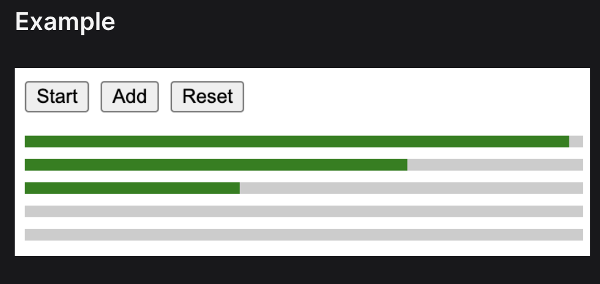

Requirements

1. Initially there will be one empty progress bar.
2. The progress bars fill up gradually in parallel, up to a limit of 3 concurrent bars filling up. i.e. the fourth progress bar will only start filling up after the third progress bar is completely filled up.
3. Each bar takes approximately 2000ms to completely fill up.
4. Implement the following buttons with the functionality:
   - Start/Pause: Starts/pauses the filling up of the progress bars. The button label turns into "Pause" when the animation is playing.
   - Add: Appends a new progress bar to the bottom of the list.
   - Reset: Resets to the initial state where there is only one empty bar and stops any running animations.

 